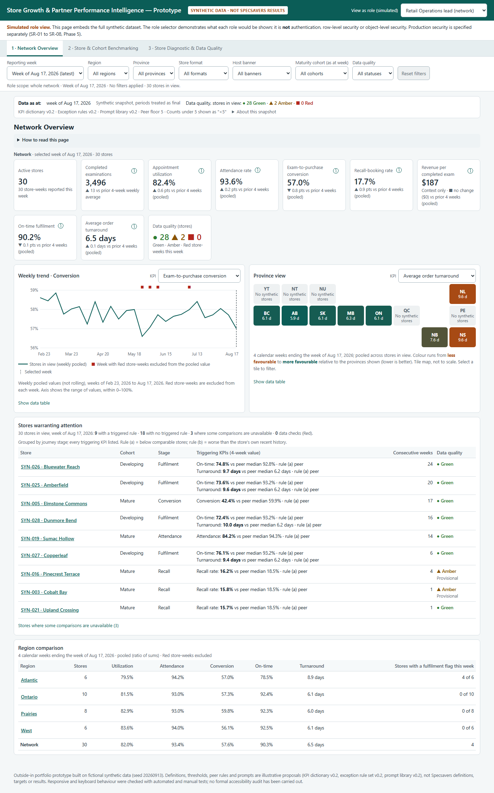
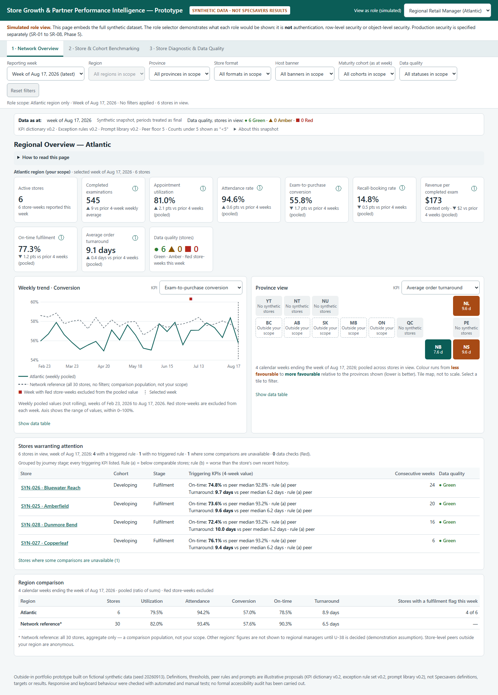
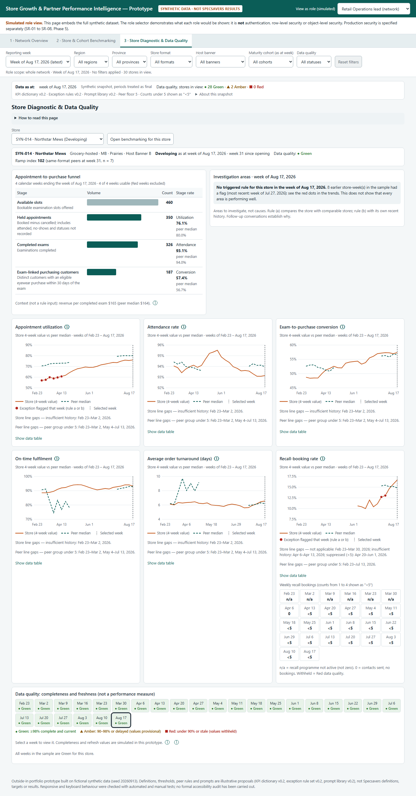
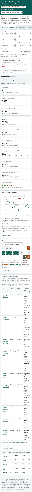
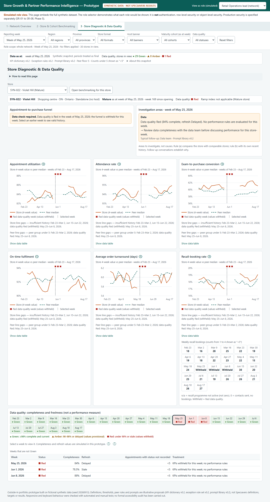
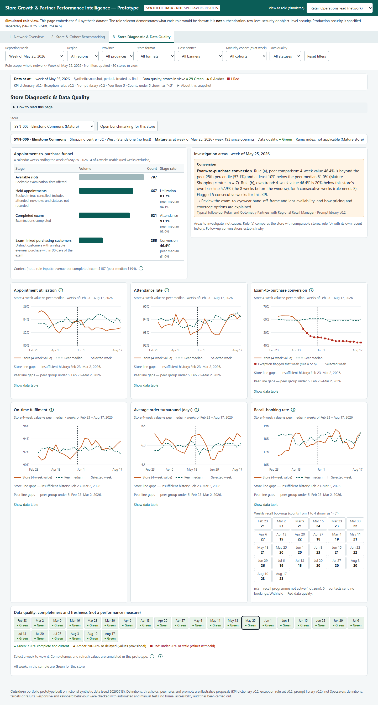

# Fair Comparisons for a Fast-Growing Network

**Store ramp-up and partner performance intelligence — an outside-in business analysis with a working prototype**

An independent business analysis of a reporting problem that any fast-growing, partner-owned retail network faces: how do
you tell a store that needs help from a store that is simply young? The analysis is framed around Specsavers Canada
using **public information only**, and every number in the prototype comes from a **fictional synthetic dataset** built
for this study.

> **Independent work. Public sources, synthetic numbers.** This study is not affiliated with, endorsed by, or informed
> by any internal knowledge of Specsavers. It does **not** claim that Specsavers' reporting is inadequate, and no figure
> here describes actual Specsavers performance — the dashboard runs on 30 fictional stores generated for this case
> study. Every threshold, KPI definition and peer rule is **my illustrative proposal**, not a Specsavers definition. No
> stakeholder has reviewed or approved any of it.

---

## The question

A network report can rank 30 stores on conversion and put the newest ones at the bottom. That reads like a performance
problem. It may only be an age problem.

Public statements sketch the conditions that make this hard. As reported in March 2026, the network had passed 270
locations across nine provinces and one territory, with more than 130 opened during 2025 — which is my arithmetic, not a
company statement, that roughly half the network was under about fifteen months old at that point. As reported in June
2026, 111 of those locations opened inside grocery stores. Back in February 2024, the company itself described 20% of
locations as open under six months. So the network mixes store ages, provinces and host formats, and each location pairs
an independent optometry practice with a retail partner.

That gives the question this study answers:

> **How would you design reporting that shows which stores warrant attention, without ranking a three-month-old store
> against a ten-year-old one — and without a single number implying a cause?**

## What I built

A 15-phase business analysis — objective, stakeholders, requirements, KPI dictionary, data model, user stories,
traceability, RAID registers, MVP, synthetic dataset, Power BI design, UAT plan — and a **working three-page prototype**
that implements the reporting rules so they can be examined rather than described.



*Prototype, Page 1. Synthetic data, week of 17 Aug 2026.*

**Three design decisions carry the answer.**

**1. Every store is compared with same-age, same-format peers.** Stores are banded into maturity cohorts (New, Developing,
Mature) and compared within cohort × format. When fewer than five peers exist, the comparison falls back to the whole
cohort and says so; below five it is suppressed rather than shown thin. New stores also get a **ramp index** against
stores of the same age, so a young store is measured against what young stores do. In the synthetic data, 36.5% of
store-weeks have enough same-age peers to carry a ramp index — the coverage limit is visible, not hidden.

**2. Scope is applied before anything is displayed.** A regional manager's view recomputes every card, chart and table
inside that region. In the synthetic data, week of 17 Aug 2026, the network view shows 30 stores and 3,496 exams while
the Atlantic view shows 6 stores and 545 exams, with the network figure kept as a labelled reference.



*Prototype, Page 1, regional manager view. Synthetic data, week of 17 Aug 2026.*

**3. A flag is an area to investigate, never a cause.** Two rules can raise one: a store sits below the 25th percentile
of its peers *and* at least 10% below their median, or its own 4-week value falls 15% or more below its own 8-week
baseline for three consecutive weeks. The prototype names which rule fired and which team typically follows up. Across
26 synthetic weeks, 228 stage flags were raised (8.8 per week across 30 stores), 99 of them in fulfilment. The ramp
trigger — an index below 80 for four consecutive weeks — is implemented and unit-tested, and **no store in the synthetic
data meets it**.



*Prototype, Page 3. Synthetic data, four weeks ending 17 Aug 2026.*

The prototype is plain HTML, CSS and JavaScript with no dependencies, and it works at phone width, at 200% zoom and
from the keyboard — a store partner reading it between appointments is a likelier user than an analyst at a desk.



*Prototype, Page 1 at 375 px. Synthetic data, week of 17 Aug 2026.*

## Where the reporting refuses to answer

The part I would most want a stakeholder to test is what the prototype **declines** to show.

| Situation | What the prototype does | In the synthetic data |
|---|---|---|
| A week's data is incomplete or stale (Red) | Withholds every KPI for that store-week, shows a data prompt instead, and excludes it from peer groups and the ramp index | 4 Red store-weeks |
| Data is late but usable (Amber) | Shows the value marked provisional | 2 Amber store-weeks in the latest week |
| A count is 1–4 | Displays "<5" — and hides any rate built on it, so the count cannot be recovered from the chart | 216 weekly recall counts |
| A count is genuinely zero | Shows 0, kept distinct from suppressed and from not-applicable | 2 weekly recall counts |
| A programme has not started | Shows "not applicable", not zero | 42 store-weeks |
| Fewer than three usable weeks in the window | Shows "insufficient history" rather than a partial average | 62 of 761 four-week recall rates |



*Prototype, Page 3, a Red data-quality week. Synthetic data, week of 25 May 2026.*

## What I propose

Pilot **peer-based exception reporting** with one region and one KPI family before building anything wider: agree the
cohort bands and the two exception rules with the people who would act on them, run them alongside existing reporting,
and measure whether follow-up gets faster and better targeted — not whether the dashboard explains performance.

The deck sets out the MVP scope, the five judgement calls behind the design, the risks, and the questions I would settle
with stakeholders first. Three of those questions are deliberately left open in the artefacts, because they are not
mine to decide: how much of other regions a regional manager should see, whether suppression needs to cover totals as
well as cells, and whether optometry partners should see conversion.



*Prototype, Page 3. Synthetic data, week of 25 May 2026.*

## What this analysis cannot show

- **No internal access.** No interviews, no internal documents, no systems, no data. Public statements and job postings
  only; the hypothesis behind the whole study would need internal validation.
- **The numbers are fictional.** 30 synthetic stores over 26 weeks (23 Feb – 17 Aug 2026), generated from seed
  20260913. They demonstrate the rules; they say nothing about any real store.
- **Roles are simulated.** The "view as role" switch is a demonstration of scoping, not authentication, row-level
  security or object-level security. The page carries the whole dataset.
- **The Power BI model is a design, not a build.** The DAX, RLS and OLS in Phase 13 have never been executed.
- **No user testing.** The UAT plan in Phase 14 has not been run, and there has been no usability study, screen-reader
  test or accessibility audit.
- **No targets.** Every threshold (peer floor 5, −15%, index 80) is an illustrative starting point for a conversation,
  not a proposed service level.

## What's in this repo

| Path | What it is |
|---|---|
| [`dashboard-mockup.html`](dashboard-mockup.html) | The interactive prototype: three pages, four simulated roles, 30 synthetic stores. Open it in a browser — no install, no network |
| [`report/Specsavers-Canada-Case-Study-Deck.pptx`](report/Specsavers-Canada-Case-Study-Deck.pptx) | The case study deck: 9 main slides plus 10 appendix slides, with speaker notes |
| [`report/figures_trace.csv`](report/figures_trace.csv) | Every figure quoted in this documentation, the analysis key it is read from, and the test that guards the rule behind it |
| [`report/test-report.md`](report/test-report.md) | What was tested, what passed, and what was not tested at all |
| [`METHODOLOGY.md`](METHODOLOGY.md) | How the cohorts, peer groups, windows and exception rules were designed, and the judgement calls behind each |
| [`CALCULATIONS.md`](CALCULATIONS.md) | How each KPI, peer statistic and flag is calculated, the parameters, and how the figures were verified |
| [`DATA_QUALITY.md`](DATA_QUALITY.md) | How data quality is treated in the design, what the synthetic data guarantees, and what a real implementation would have to check instead |
| [`phases/`](phases/) | The 14 phase documents plus the evidence log, feature-status matrix, issue register and consistency check |
| [`data/synthetic_store_weekly.csv`](data/synthetic_store_weekly.csv) | The synthetic dataset: 761 store-weeks, 24 columns |
| [`data/powerbi/`](data/powerbi/) | Store-week KPI, revenue and ramp-index tables in the shape the Power BI design describes |
| [`build/`](build/) | The generator, calculation engine, dashboard logic and build scripts |
| [`tests/`](tests/) | Calculation tests, Python ↔ JavaScript reconciliation, and rendered-page tests |
| [`assets/`](assets/) | Prototype screenshots used above |

`data/analysis_summary.json` is **not** in the repo: it is a 1.5 MB build artefact that
`build/validate_and_analyze.py` regenerates from the CSV in a few seconds.

## Reproducing this

```bash
pip install -r requirements.txt
python build/generate_synthetic.py       # rebuild the dataset (seed 20260913, byte-identical)
python build/validate_and_analyze.py     # 32 structural and pattern checks; writes the analysis output
python build/build_mockup.py             # rebuild dashboard-mockup.html from the template, logic and data
python build/make_figures_trace.py       # rebuild report/figures_trace.csv from the analysis output
```

Tests (Node 22+ for the JavaScript tests, Microsoft Edge for the rendered-page tests):

```bash
python -m unittest discover -s tests -p "test_*.py"
```
```bash
node --test tests/test_dashboard_logic.js
```

The rendered-page suite (`node tests/ui_regression.js`), the document/deck consistency scan and the
`build/run_tests.py` runner expect the full project layout, where the phase documents and the deck sit beside `build/`;
this package groups them under `phases/` and `report/` instead.

## Sources and positioning

Public sources only: company and partner press releases, the corporate site, publicly posted job advertisements and
provincial regulatory pages. Each one is listed with its date, access status and what it does and does not support in
[`phases/evidence-log.md`](phases/evidence-log.md), where company statements, my inferences and my assumptions are
labelled separately.

Specsavers is used as a **public context** for the analysis. No confidential information was used, no patient or
employee data appears anywhere (the synthetic data is store-week aggregates only), and nothing here should be read as a
statement about how Specsavers actually reports or performs.
