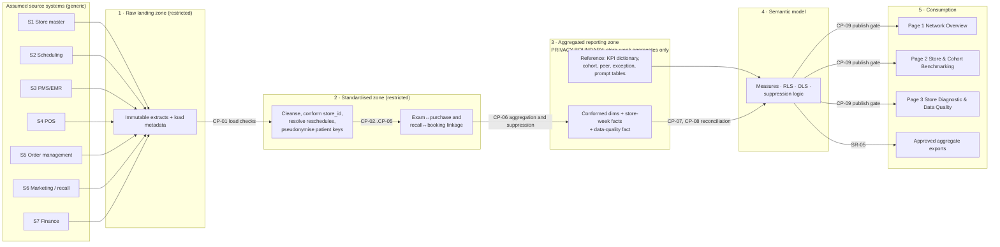

# Phase 7 — Conceptual Data Model and Data Flow

**Status:** Drafted by the author (conceptual; not implemented or validated) · **Prepared:** 2026-09-13 · **Revised:** repair pass (FACT_SALES split, TQ-06 resolved, TQ-12 added) · **Builds on:** Phases 1–6

> **Outside-in disclaimer.** Every system named here is a **generic, assumed system category**, not a named Specsavers platform. Public sources show that categories such as patient-record systems, POS, ERP and PMS/EMR exist (EV-05, EV-09d), and that data roles use Power BI, SQL and Databricks (EV-09a–c). **Specsavers' actual architecture, integrations and schemas are unknown.** The layered design below is a generic pattern proposed for the case study.

---

## 1. Entity descriptions

### Dimensions

| Entity | Description | Key attributes |
|---|---|---|
| **DIM_STORE** | One row per store **version** (effective-dated) | store_key (SK), store_id (durable natural key), store_name, store_format, host_banner, opening_date, closing_date, store_status, effective_from, effective_to, is_current |
| **DIM_DATE** | Calendar at day grain, rolled up to reporting week (Mon–Sun) | date_key, calendar_date, week_start_date, week_end_date, reporting_week_label, month, quarter, year, is_published_week |
| **DIM_GEOGRAPHY** | Province and internal region hierarchy (effective-dated region assignment) | geo_key (SK), province_code, province_name, region_name, country, effective_from, effective_to |
| **DIM_MATURITY_COHORT** | Versioned cohort bands by weeks since opening | cohort_key (SK), cohort_name (New / Developing / Mature / Unclassified), min_weeks, max_weeks, definition_version, effective_from, approved_by |

### Facts (reporting grain)

| Entity | Description |
|---|---|
| **FACT_APPOINTMENT** | Weekly examination-appointment capacity and booking outcomes per store |
| **FACT_EXAMINATION** | Weekly completed examinations per store (counts only) |
| **FACT_EXAM_CONVERSION** *(replaces the exam-week part of FACT_SALES)* | Weekly exam-linked purchasing customers per store, by **exam week** (with the attribution-window status) |
| **FACT_SALES_REVENUE** *(replaces the transaction-week part of FACT_SALES)* | Weekly net eligible eyewear revenue and returns per store, by **transaction week** |
| **FACT_ORDER_FULFILMENT** | Weekly order cohort (by placed week) turnaround and on-time outcomes per store |
| **FACT_RECALL_CAMPAIGN** | Weekly recall contacts and resulting bookings (by contact week) per store |
| **FACT_DATA_QUALITY** | Per store, week and source: completeness, freshness and rule results |

### Supporting reference and security tables

| Entity | Purpose |
|---|---|
| DIM_SOURCE_SYSTEM | List of the 7 generic source systems (for data-quality and lineage) |
| REF_KPI_DICTIONARY | Governed KPI definitions and versions (FR-07, DR-02) |
| REF_PEER_RULE / REF_EXCEPTION_RULE | Versioned peer floor, fallback and exception thresholds (FR-06, FR-16) |
| REF_INVESTIGATION_PROMPT | Versioned prompt library by KPI and variance direction (FR-15) |
| SEC_USER_STORE_ACCESS | User → role → store or region mapping for RLS (SR-02); **not** exposed in reports |
| AGG_PEER_BENCHMARK *(added in Phase 13; see Phase 13 correction)* | Precomputed, leave-one-out peer statistics per store × week × KPI (median, P25, P75, n, basis) and anonymised peer distributions per cohort × format × week × KPI. **Required because row-level security hides other stores' rows from partners, so peer medians cannot be calculated at query time under their role.** Values are aggregates only; suppression (PR-03) is applied before load. |
| AGG_EXCEPTION_FLAG *(added in Phase 13)* | Precomputed exception flags per store × week × KPI (rule, rule version, value, peer median, consecutive weeks), so that versioned rules (DR-02) are applied once, upstream |

---

## 2. Proposed keys

| Table | Primary key | Natural or business key | Foreign keys |
|---|---|---|---|
| DIM_STORE | store_key | store_id + effective_from | geo_key (as at version) |
| DIM_DATE | date_key (yyyymmdd) | calendar_date | — |
| DIM_GEOGRAPHY | geo_key | province_code + region_name + effective_from | — |
| DIM_MATURITY_COHORT | cohort_key | cohort_name + definition_version | — |
| FACT_APPOINTMENT | (store_key, week_date_key) | store_id + week_start | store_key, week_date_key, geo_key, cohort_key |
| FACT_EXAMINATION | (store_key, week_date_key) | same | same |
| FACT_EXAM_CONVERSION | (store_key, exam_week_date_key) | store_id + exam week | same |
| FACT_SALES_REVENUE | (store_key, transaction_week_date_key) | store_id + transaction week | same |
| FACT_ORDER_FULFILMENT | (store_key, placed_week_date_key) | store_id + placed week | same |
| FACT_RECALL_CAMPAIGN | (store_key, contact_week_date_key) | store_id + contact week | same |
| FACT_DATA_QUALITY | (store_key, week_date_key, source_key) | store_id + week + source | + source_key |

**Key design notes**
- `store_id` is the **cross-system conformed key**. Every source's local store code maps to it through a governed crosswalk (MDM-02). Unmapped codes are quarantined, not dropped.
- `cohort_key` and `weeks_since_opening` are **derived as at each fact week** (DR-10), resolving the static-cohort problem: a store can be New in week 1 and Developing in week 5 of the same period.
- `geo_key` is resolved as at the week, so historical results stay in the region they belonged to at the time.

---

## 3. Grain of each fact

| Fact | Grain (one row per…) | Measures | Degenerate or derived attributes |
|---|---|---|---|
| FACT_APPOINTMENT | store × reporting week | available_slots, booked_appointments, cancelled_appointments, no_show_appointments, unresolved_status_appointments | weeks_since_opening |
| FACT_EXAMINATION | store × reporting week | completed_exams | weeks_since_opening |
| FACT_EXAM_CONVERSION | store × exam week | completed_exams_linked (denominator copy for reconciliation), purchasing_customers (exam-linked, distinct), linkage_match_rate | attribution_window_days, attribution_complete_date, is_provisional |
| FACT_SALES_REVENUE | store × transaction week | eyewear_revenue_net, returns_refunds_amount, transactions | — |
| FACT_ORDER_FULFILMENT | store × order-placed week | orders_placed, orders_ready, orders_ready_on_time, total_turnaround_days, orders_missing_promised_date | is_provisional |
| FACT_RECALL_CAMPAIGN | store × recall-contact week | recall_contacts, recall_bookings | is_provisional, recall_programme_active_flag |
| FACT_DATA_QUALITY | store × reporting week × source system | expected_records, received_records, completeness_pct, last_successful_load_ts, freshness_status, rules_failed_count | — |

*Conversion and revenue grain (corrected in the repair pass, ISS-30).* The earlier draft stored exam-week purchaser counts and transaction-week revenue in one FACT_SALES table with two date keys. Two independent weekly aggregates cannot share a row without defining what the row means (a purchaser counted in week 10 may have spent in week 12). They are therefore **separate facts**: FACT_EXAM_CONVERSION (row = store × exam week; purchasers attributed back to the exam week once the 30-day window closes) and FACT_SALES_REVENUE (row = store × transaction week). KPI-06 (revenue per exam) divides transaction-week revenue by exam-week completed exams for the **same calendar week**; this is why KPI-06 is context-only and "not exam-linked". TQ-06 is resolved by this decision.

*Prototype simplification:* the synthetic CSV is one flattened store-week extract in which purchasing customers and revenue sit on the same row and every period is treated as final (Phase 12).

---

## 4. Relationships

| From (many) | To (one) | Cardinality | Filter direction (report model) | Notes |
|---|---|---|---|---|
| Each FACT_* | DIM_STORE | many-to-one | Single (dim → fact) | RLS applied on DIM_STORE via SEC_USER_STORE_ACCESS |
| Each FACT_* | DIM_DATE | many-to-one | Single | Each fact joins on its own week key (exam week, transaction week, placed week, contact week) to the week-start date in a **contiguous daily** DIM_DATE |
| Each FACT_* | DIM_GEOGRAPHY | many-to-one | Single | As-at-week geography |
| Each FACT_* | DIM_MATURITY_COHORT | many-to-one | Single | As-at-week cohort |
| FACT_DATA_QUALITY | DIM_SOURCE_SYSTEM | many-to-one | Single | |
| SEC_USER_STORE_ACCESS | DIM_STORE | many-to-many via store_id | Security filter only | Not visible to report users |

**Modelling rules:** no fact-to-fact relationships; facts combine through conformed dimensions. No bidirectional filters, except where security design requires them (to be reviewed by SH-10).

---

## 5. Conceptual star schema

```mermaid
erDiagram
    DIM_STORE ||--o{ FACT_APPOINTMENT : "store_key"
    DIM_STORE ||--o{ FACT_EXAMINATION : "store_key"
    DIM_STORE ||--o{ FACT_EXAM_CONVERSION : "store_key"
    DIM_STORE ||--o{ FACT_SALES_REVENUE : "store_key"
    DIM_STORE ||--o{ FACT_ORDER_FULFILMENT : "store_key"
    DIM_STORE ||--o{ FACT_RECALL_CAMPAIGN : "store_key"
    DIM_STORE ||--o{ FACT_DATA_QUALITY : "store_key"
    DIM_DATE ||--o{ FACT_APPOINTMENT : "week_date_key"
    DIM_DATE ||--o{ FACT_EXAMINATION : "week_date_key"
    DIM_DATE ||--o{ FACT_EXAM_CONVERSION : "exam_week"
    DIM_DATE ||--o{ FACT_SALES_REVENUE : "transaction_week"
    DIM_DATE ||--o{ FACT_ORDER_FULFILMENT : "placed_week"
    DIM_DATE ||--o{ FACT_RECALL_CAMPAIGN : "contact_week"
    DIM_DATE ||--o{ FACT_DATA_QUALITY : "week_date_key"
    DIM_GEOGRAPHY ||--o{ FACT_APPOINTMENT : "geo_key"
    DIM_GEOGRAPHY ||--o{ FACT_EXAMINATION : "geo_key"
    DIM_GEOGRAPHY ||--o{ FACT_EXAM_CONVERSION : "geo_key"
    DIM_GEOGRAPHY ||--o{ FACT_SALES_REVENUE : "geo_key"
    DIM_GEOGRAPHY ||--o{ FACT_ORDER_FULFILMENT : "geo_key"
    DIM_GEOGRAPHY ||--o{ FACT_RECALL_CAMPAIGN : "geo_key"
    DIM_MATURITY_COHORT ||--o{ FACT_APPOINTMENT : "cohort_key"
    DIM_MATURITY_COHORT ||--o{ FACT_EXAMINATION : "cohort_key"
    DIM_MATURITY_COHORT ||--o{ FACT_EXAM_CONVERSION : "cohort_key"
    DIM_MATURITY_COHORT ||--o{ FACT_SALES_REVENUE : "cohort_key"
    DIM_MATURITY_COHORT ||--o{ FACT_ORDER_FULFILMENT : "cohort_key"
    DIM_MATURITY_COHORT ||--o{ FACT_RECALL_CAMPAIGN : "cohort_key"
    DIM_SOURCE_SYSTEM ||--o{ FACT_DATA_QUALITY : "source_key"
    DIM_STORE {
        int store_key PK
        string store_id
        string store_name
        string store_format
        string host_banner
        date opening_date
        date effective_from
        date effective_to
    }
    DIM_DATE {
        int date_key PK
        date week_start_date
        string reporting_week_label
    }
    DIM_GEOGRAPHY {
        int geo_key PK
        string province_code
        string region_name
    }
    DIM_MATURITY_COHORT {
        int cohort_key PK
        string cohort_name
        int min_weeks
        int max_weeks
        string definition_version
    }
    FACT_APPOINTMENT {
        int available_slots
        int booked_appointments
        int cancelled_appointments
        int no_show_appointments
        int unresolved_status_appointments
    }
    FACT_EXAMINATION {
        int completed_exams
    }
    FACT_EXAM_CONVERSION {
        int purchasing_customers
        date attribution_complete_date
        bool is_provisional
    }
    FACT_SALES_REVENUE {
        decimal eyewear_revenue_net
        decimal returns_refunds_amount
    }
    FACT_ORDER_FULFILMENT {
        int orders_placed
        int orders_ready_on_time
        decimal total_turnaround_days
    }
    FACT_RECALL_CAMPAIGN {
        int recall_contacts
        int recall_bookings
    }
    FACT_DATA_QUALITY {
        decimal completeness_pct
        string freshness_status
    }
```

**Prototype simplification (Phase 12–13):** the synthetic CSV is a **flattened store-week extract** combining the six facts and the store attributes. This lets the Power BI prototype be built quickly. The target model above keeps separate facts so that each source can load, reconcile and version independently.

---

## 6. Source-to-target mapping

**Generic source systems (assumed):** S1 Store master · S2 Scheduling system · S3 PMS/EMR · S4 Point-of-sale (POS) · S5 Order-management system · S6 Marketing/recall platform · S7 Finance system.

| # | Target table.column | Source | Assumed source entity or field | Transformation or business rule | DQ checkpoint | Synthetic CSV field |
|---|---|---|---|---|---|---|
| M-01 | DIM_STORE.store_id | S1 | Store identifier | Conformed durable key; crosswalk from local codes | CP-02 | store_id |
| M-02 | DIM_STORE.store_name | S1 | Store display name | Trim; title case | CP-02 | store_name |
| M-03 | DIM_STORE.store_format | S1 | Location type | Map to controlled list: Grocery-hosted / Shopping centre / Street-front | CP-02 | store_format |
| M-04 | DIM_STORE.host_banner | S1 | Host retailer or banner | Map to controlled list; generic labels in prototype | CP-02 | retail_banner |
| M-05 | DIM_STORE.opening_date | S1 (owner SH-15) | Opening date | Validate ≤ first activity date in S2/S4; flag conversions and relocations | CP-02, CP-04 | opening_date |
| M-06 | DIM_GEOGRAPHY.province_code / region_name | S1 | Province; region assignment | Effective-dated region mapping | CP-02 | province, region |
| M-07 | FACT_*.weeks_since_opening, cohort_key | Derived | opening_date, week_start, cohort table | floor((week_start − opening_date) ÷ 7) → cohort band (DR-10) | CP-04 | maturity_cohort (as at week) |
| M-08 | FACT_APPOINTMENT.available_slots | S2 | Slot template / calendar | Count bookable exam-type slots in week; exclude blocked and closed days | CP-03 | available_appointment_slots |
| M-09 | FACT_APPOINTMENT.booked_appointments | S2 | Appointment records (final scheduled date in week) | Count exam-type appointments; reschedules resolved to final date (A-29) | CP-03 | booked_appointments |
| M-10 | FACT_APPOINTMENT.cancelled_appointments | S2 | Appointment status = cancelled | Count | CP-03 | cancelled_appointments |
| M-11 | FACT_APPOINTMENT.no_show_appointments | S2 | Appointment status = no-show / DNA | Count | CP-03 | no_show_appointments |
| M-12 | FACT_APPOINTMENT.unresolved_status_appointments | Derived | booked − completed − cancelled − no-show | Must be ≥ 0; feeds completeness | CP-05 | (derived in model) |
| M-13 | FACT_EXAMINATION.completed_exams | S3 (reconciled to S2) | Completed exam encounter (counts only) | Count by exam week; exclude voided or test records; **aggregate in restricted zone** | CP-03, CP-06 | completed_exams |
| M-14 | FACT_EXAM_CONVERSION.purchasing_customers | S3 + S4 | Exam encounter ↔ eyewear transaction, via pseudonymised customer link | Distinct customers with eligible purchase ≤ 30 days after exam at same store; net of full refunds; **linkage in restricted zone** | CP-06, CP-07 | purchasing_customers |
| M-15 | FACT_SALES_REVENUE.eyewear_revenue_net | S4 (control: S7) | Transaction lines: eligible categories; returns | Σ net eligible line value excl. tax; returns in processed week | CP-06, CP-08 | eyewear_revenue |
| M-16 | FACT_ORDER_FULFILMENT.orders_placed | S5 | Order header (placed date) | Count non-cancelled orders by placed week | CP-03 | orders_placed |
| M-17 | FACT_ORDER_FULFILMENT.orders_ready_on_time | S5 | Ready date ≤ promised date | Count | CP-05 | orders_ready_on_time |
| M-18 | FACT_ORDER_FULFILMENT.total_turnaround_days | S5 | Ready date − placed date | Σ calendar days; average = total ÷ orders_ready (orders not yet ready stay provisional) | CP-05 | average_turnaround_days *(prototype: no orders_ready column; all placed orders assumed ready, KPI-07 v0.2 note)* |
| M-19 | FACT_RECALL_CAMPAIGN.recall_contacts | S6 | Deliverable recall contacts | Distinct patients contacted in week; exclude opt-outs and undeliverable | CP-03 | recall_contacts |
| M-20 | FACT_RECALL_CAMPAIGN.recall_bookings | S6 + S2 | Contact ↔ subsequent booking (pseudonymised) | Distinct contacted patients booking ≤ 30 days; linkage in restricted zone | CP-06 | recall_bookings |
| M-21 | FACT_DATA_QUALITY.completeness_pct | Pipeline metadata | Records expected and received per source | Per source: received ÷ expected (capped at 100%); store-week value = equal-weighted mean across expected sources (KPI-11 v0.2) | CP-01, CP-09 | data_completeness_pct *(simulated in the prototype, not derived from load metadata)* |
| M-22 | FACT_DATA_QUALITY.freshness_status | Pipeline metadata | Last successful load timestamp and coverage | Current / Delayed / Stale per DR-05; worst source wins | CP-01, CP-09 | data_refresh_status |
| M-23 | Control totals (reconciliation) | S7, S3, S5 | Weekly control totals | Compare to fact totals within tolerance (DR-08) | CP-08 | — |

---

## 7. End-to-end data flow

**Flow narrative**
1. **Extract.** Weekly (or more frequent) extracts land unchanged with load metadata: time, row counts, coverage window.
2. **Standardise.** Local store codes map to `store_id`. Appointment statuses are normalised and reschedules resolved. Patient identifiers are replaced with pseudonymous keys **inside the restricted zone** under data-custodian controls (U-29).
3. **Link.** Exam ↔ purchase and recall ↔ booking linkage happens in the restricted zone only.
4. **Aggregate at the privacy boundary.** Only store-week aggregates move to the reporting zone. No patient keys, clinician identifiers or clinical content cross this line (PR-01, PR-02, PR-05).
5. **Model.** The semantic model applies measures, RLS/OLS, peer and suppression logic, and reads governed reference tables.
6. **Publish gate.** A refresh is published only if the critical checks pass. Otherwise the prior week stays published with a banner.

---

## 8. Data-quality checkpoints

| ID | Stage | Check | Rule (illustrative) | On failure | Surfaces as |
|---|---|---|---|---|---|
| CP-01 | Raw landing | Load completeness and freshness | Each expected source file or table present; coverage window = full week; row count within ±30% of the trailing 4-week average | Mark source Delayed or Stale; alert data team | KPI-12; FACT_DATA_QUALITY |
| CP-02 | Standardised | Store master conformance | Every source store code maps to an active store_id; valid opening date, province, region, format | Quarantine unmapped rows; count in DQ fact | Store "Unclassified"; DQ warning |
| CP-03 | Standardised | Domain validity | Non-negative counts; valid statuses; dates within week | Reject row to error table | Completeness reduction |
| CP-04 | Standardised | Opening-date plausibility | opening_date ≤ first appointment or sale; not in future | Flag store; cohort = Unclassified | FR-03 warning |
| CP-05 | Standardised | Arithmetic invariants | completed + cancelled + no-show ≤ booked ≤ slots; on-time ≤ placed; ready date ≥ placed date | Flag store-week; unresolved statuses counted | Amber or Red status |
| CP-06 | Aggregation | Privacy boundary | No identifier columns in output; suppression flags for counts < 5 | **Block publish** | Release blocked |
| CP-07 | Aggregation | Linkage quality | Exam↔purchase match rate ≥ threshold (e.g., 95%) | Conversion flagged Amber | KPI-05 marker |
| CP-08 | Model | Reconciliation | Exams ±0.5%, revenue ±1.0%, orders ±0.5% versus control totals (DR-08) | Domain owner review; KPI flagged | Reconciliation report |
| CP-09 | Publish | Publish gate | CP-06 passed; ≥ 95% of active stores Green or Amber (illustrative) | Keep prior published week; banner | Report banner |

---

## 9. Master-data responsibilities

| ID | Master-data element | Business owner (proposed) | Technical steward | Standard | Change process |
|---|---|---|---|---|---|
| MDM-01 | Store record (id, name, status) | SH-04 Retail Operations | SH-10 | Unique durable store_id; never reused | New store created before first booking is possible |
| MDM-02 | Source store-code crosswalk | SH-10 | SH-17 source owners | 1 local code → 1 store_id per effective period | New code mapped before go-live of the store in that system |
| MDM-03 | Opening date and conversion/relocation flags | **SH-15 Business Development** (to confirm, DQ-33) | SH-10 | Single agreed opening-event definition; a store record carries `opening_type` (new build · conversion from another brand · relocation · rebrand) and, where relevant, `predecessor_store_id` (TQ-12) | Changes versioned; triggers cohort recalculation. *Limitation:* the prototype treats every store as a genuinely new opening |
| MDM-04 | Province and region assignment | SH-04 | SH-10 | Effective-dated; region list controlled | Region changes effective from a dated week; no restatement unless approved |
| MDM-05 | Store format and host banner | SH-04 / SH-15 | SH-10 | Controlled values | Versioned change |
| MDM-06 | Maturity cohort bands | SH-04 (approve), SH-13 (governance) | SH-09 | Versioned cohort table | KPI change control (DR-02) |
| MDM-07 | Peer floor and suppression thresholds | **SH-13 sets floor**; SH-04 may raise | SH-09 | Versioned rule table | KPI change control |
| MDM-08 | User–store access mapping | SH-04 (business approval), SH-13 | SH-10 | Authoritative HR or partner source (A-24) | Joiner/mover/leaver within 1 business day (SR-02) |
| MDM-09 | KPI dictionary and prompt library | Per-KPI owners (Phase 6); SH-04 for prompts | SH-09 | Versioned | KPI change control |

---

## 10. Lineage requirements

| ID | Requirement | Links |
|---|---|---|
| LIN-01 | Each report visual lists the measures it uses; each measure references a KPI ID and version. | DR-01, FR-07 |
| LIN-02 | Each measure's lineage documents fact column(s) → transformation rule (mapping M-xx) → source system and entity. | DR-01 |
| LIN-03 | Reference-table versions (cohort, peer, exception, prompt) are recorded per refresh so historical outputs can be reproduced. | DR-02 |
| LIN-04 | Load metadata (extract time, row counts, rule failures) is kept per refresh for 13 months (illustrative). | DR-05, SR-04 |
| LIN-05 | Impact analysis: any source field change identifies affected KPIs, visuals and user groups before deployment. | NFR-07 |
| LIN-06 | Lineage register reviewed at each KPI version change and quarterly. | DR-02 |

---

## 11. Privacy and access controls in the data flow

| Zone | Contains | Access | Controls |
|---|---|---|---|
| 1 Raw landing | Source extracts, potentially including personal and health information | Named data engineers under custodian approval | Encryption at rest and in transit (assumed); no BI tool access; retention per source policy (DR-03) |
| 2 Standardised | Pseudonymised patient keys; linkage tables | Restricted engineering roles | Pseudonymisation; access logging; linkage keys never exported |
| 3 Aggregated reporting | Store-week aggregates, reference tables | Data team; semantic model service identity | **Privacy boundary** (CP-06); suppression flags; no identifiers |
| 4 Semantic model | Measures, RLS/OLS | Report users via roles | SR-01 to SR-03; PR-03, PR-04, PR-07 |
| 5 Consumption | Reports and aggregate exports | Authorised roles | SR-05 export controls; SR-04 audit; SSO/MFA (SR-07) |

---

## 12. Unresolved technical questions

| ID | Question | Why it matters | Owner to ask |
|---|---|---|---|
| TQ-01 | Which of the assumed sources already land in the data platform, and at what latency? | Effort and NFR-02 feasibility | SH-10, SH-17 |
| TQ-02 | Is there an existing store crosswalk or master-data hub? | MDM-02 effort | SH-10 |
| TQ-03 | Can exam ↔ purchase linkage be performed, and under whose custody (Optometry Partner corporations versus Specsavers)? | KPI-05 feasibility; privacy | SH-13, SH-02, SH-17 |
| TQ-04 | Do scheduling and PMS/EMR share appointment identifiers? | Reconciliation of KPI-03 and KPI-04 | SH-17 |
| TQ-05 | How are reschedules represented in the scheduling data (new record versus updated record)? | A-29 validity | SH-17 |
| TQ-06 | Should revenue (transaction week) and conversion (exam week) be separate facts to simplify date roles? **Resolved (repair pass): yes — FACT_EXAM_CONVERSION and FACT_SALES_REVENUE (§3).** Confirm with SH-10 and SH-11. | Model usability | SH-10, SH-11 |
| TQ-12 *(new)* | How are **converted, relocated or rebranded** stores recorded? A store converted from another optical brand, or relocated nearby, is not a genuinely new opening: it may bring patients, recall lists and trading history. Which date should weeks since opening use, and should such stores be excluded from New-store peer groups? | Cohort and ramp-index fairness (FR-03, KPI-10); the synthetic data does **not** cover this case | SH-15, SH-04 |
| TQ-07 | Are finance control totals available by store-week, or only by month? | DR-08 tolerance design | SH-07 |
| TQ-08 | Does the platform support object-level security and export restrictions as required? | SR-03, SR-05 | SH-11, SH-13 |
| TQ-09 | How are "expected records" estimated for brand-new stores? | KPI-11 reliability for New stores | SH-10 |
| TQ-10 | Time zones: are timestamps stored in local store time or UTC? | Week assignment near midnight for Atlantic and Pacific stores | SH-10 |
| TQ-11 | Are there existing semantic models (e.g., sales) to reuse? | Avoid duplicate definitions | SH-11 |

---

## Phase 7 close

### Decisions made
1. Star schema with 4 conformed dimensions and 6 store-week facts, plus reference and security tables.
2. **Cohort and geography are resolved as at each fact week**; store attributes are effective-dated.
3. A **privacy boundary** at the aggregated reporting zone: linkage and pseudonymisation happen only upstream.
4. The prototype uses a flattened store-week CSV; the target keeps separate facts.
5. Nine data-quality checkpoints (CP-01 to CP-09), including a publish gate that blocks on privacy failure.

### Assumptions introduced
| ID | Assumption |
|---|---|
| A-32 | A layered data platform (raw → standardised → aggregated → semantic) is available or feasible (a generic pattern, not a confirmed architecture). |
| A-33 | Pseudonymous linkage keys can be created under appropriate custody. |
| A-34 | Source store codes can be crosswalked to one durable store_id. |

### Questions requiring validation
TQ-01 to TQ-11 above. The most critical are TQ-03 (linkage custody) and TQ-02 (store crosswalk).

### Recommended corrections
- The synthetic CSV column `maturity_cohort` will be defined as **cohort as at the week** (not a static store attribute), in line with DR-10.
