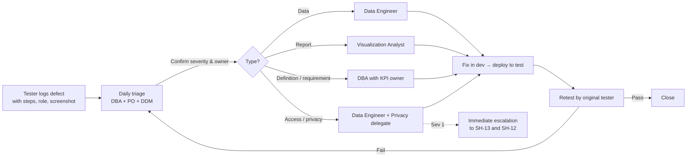

# Phase 14 — UAT and Implementation Plan

**Status:** Plan drafted by the author · **UAT with business users has not been executed** · automated prototype tests exist (Section 17) · **Prepared:** 2026-09-13 · **Revised:** repair pass · **Builds on:** Phases 1–13

> **Outside-in disclaimer.** This is an illustrative test and implementation plan for a case study. Test data is **synthetic** (Phase 12). Timelines, thresholds and roles are proposals requiring internal validation. Store IDs such as SYN-014 refer to fictional synthetic stores.

---

## 1. UAT objective

Confirm with representative business users that the MVP reporting product is:
1. **Fit for purpose.** It supports decisions MD-1 to MD-5 (Phase 11).
2. **Accurate.** KPIs match the approved definitions and reconcile to control totals within tolerance.
3. **Safe.** Access, suppression and export controls protect patient-derived and partner commercial information.
4. **Usable and accessible.** Core tasks can be completed quickly by all intended users.
5. **Correctly interpreted.** Flags are understood as areas to investigate, not proven causes.

UAT results form the evidence for the go/no-go decision (US-09).

## 2. UAT participants

| Participant | Stakeholder | Number (illustrative) | Responsibilities |
|---|---|---|---|
| Regional Retail Managers | SH-03 | 2–3 | Execute triage, peer, drill-through and exception scenarios; usability tasks |
| Retail Partners (pilot stores) | SH-01 | 2–3 | Own-store view, anonymised peers, comprehension check |
| Optometry Partners (pilot stores) | SH-02 | 1–2 | Clinical-activity view, revenue hidden, wording review |
| Retail Operations lead | SH-04 | 1 | Network scenarios; business sign-off |
| Finance analyst | SH-07 | 1 | Revenue reconciliation (UAT-16) |
| Supply Chain analyst | SH-06 | 1 | Fulfilment reconciliation (UAT-17) |
| Marketing analyst | SH-05 | 1 | Recall reconciliation (UAT-17) |
| Privacy Officer or delegate | SH-13 | 1 | Witness access, export and suppression tests; privacy sign-off |
| Product Owner | SH-08 | 1 | Story acceptance; defect prioritisation; co-sign |
| Data Business Analyst (UAT lead) | SH-09 | 1 | Plan, scripts, coordination, triage, reporting |
| Data Engineer, Visualization Analyst | SH-10, SH-11 | 1 each | Defect investigation and fixes; environment support |
| Data Delivery Manager | SH-12 | 1 | Entry and exit gates; release readiness |

## 3. Entry criteria

| # | Criterion | Evidence |
|---|---|---|
| EN-1 | All MVP stories (US-01, US-03–US-07, US-10; US-02 and US-08 if in scope) are built and pass system testing and Definition of Done | Sprint review; test log |
| EN-2 | Test environment populated with the Phase 12 synthetic dataset and, where approved, masked reconciliation extracts (PR-08) | Environment checklist |
| EN-3 | Role-based test accounts created for every role in the Phase 5 role model (A-35) | Account list |
| EN-4 | KPI dictionary v1.0 (or approved test version) loaded to REF_KPI_DICTIONARY | FR-07 coverage check |
| EN-5 | Privacy review approved for the test scope (PR-06); schema scan passed (PR-01, PR-02, PR-05) | Approval record |
| EN-6 | UAT scripts, expected results and defect process approved by SH-08 | Signed plan |
| EN-7 | Testers booked and briefed (one-hour orientation) | Calendar; attendance |
| EN-8 | No open Severity 1 defects from system testing | Defect log |
| EN-9 | US-02 and US-10 readiness questions resolved (U-38, U-39) or scenarios marked conditional | Decision log |

## 4 & 5. Test scenarios and expected results

**Test data reference:** `data/synthetic_store_weekly.csv`; validation evidence in `data/validation-results.md`. The latest week is **2026-08-17 (W26)**.

| UAT | Scenario | Linked stories | Linked requirements | Tester role | Steps (summary) | Expected result |
|---|---|---|---|---|---|---|
| UAT-01 | Network overview KPIs and totals | US-01 | FR-01, DR-06, BR-01, BR-11 | ROL | Open report; check default week; compare KPI cards with independent calculation | Default week W26. Rates = Σnumerator ÷ Σdenominator (±0.1 pt). Red store-weeks excluded with footnote count. Access KPIs (exams, attendance, recall) visible with commercial KPIs |
| UAT-02 | Region and province filtering; regional pattern | US-02, US-01 | FR-02, BR-07 | RRM | Filter region = Atlantic; sort regions by turnaround | All visuals filter. Atlantic highest turnaround. "5 of 6 stores above network median" shown. Prompt is non-causal |
| UAT-03 | Maturity cohort assignment and boundary | US-03 | FR-03, DR-10 | RRM | Select SYN-014; view weekly cohort | New through week starting 2026-07-13 (week 26 since opening); Developing from 2026-07-20 (week 27) |
| UAT-04 | Peer median, variance and basis | US-03 | FR-04, PR-07 | RRM, RP | Select a Developing grocery-hosted store at W26; compare with independent calculation | Basis "Developing · Grocery-hosted · n = 7"; median and variance match; partners see anonymous peers |
| UAT-05 | Drill-through network → region → store | US-02 | FR-05, SR-02 | RRM | Drill from region table to a store diagnostic; press Back | Correct store and week context; Back restores filters; out-of-scope stores unavailable |
| UAT-06 | Exception flags on seeded patterns | US-04, US-02 | FR-06, FR-14, BR-09 | RRM, RP | View exceptions for SYN-012, SYN-019 (attendance), SYN-005 (conversion), Atlantic stores (fulfilment) | Attendance flagged for SYN-012 (22 of 26 weeks) and SYN-019 (21 weeks). SYN-012 falls just inside the 10% rule-(a) margin in the last 2 weeks, so it is unflagged there (expected: shows threshold sensitivity). Conversion flagged for SYN-005 (rule a from 2026-04-27; rule b 2026-05-11 to 06-08). Fulfilment flagged for Atlantic Developing stores SYN-025 to SYN-028 in W26, each listing **both** on-time and turnaround. **Not** flagged: SYN-029 (near network norm) and SYN-030 (peer-based comparison unavailable because its New-cohort peer groups are under 5 stores; its own values remain visible and the pattern shows in the regional view, which is why Page 1 keeps the region comparison). Rule (a) explanations cite peers; rule (b) explanations cite the store's own baseline. Rule set version shown |
| UAT-07 | KPI definition access and versioning | US-05 | FR-07, DR-02 | FUN-FIN | Hover info icons; open Definitions; simulate v0.2 change | Definition, owner and version match Phase 6; version change logged; draft KPIs absent |
| UAT-08 | Data-quality status and withholding | US-06 | FR-08, DR-04, DR-05, DR-09 | RRM | Check SYN-022 (2026-05-25 to 06-08), SYN-027 (2026-07-06), SYN-009 (2026-04-20, 04-27), SYN-003 and SYN-016 (W26) | SYN-022 and SYN-027 weeks Red with KPI values withheld **in the Red week itself** (no value carried from earlier weeks), no performance exceptions or prompts, and excluded from other stores' peer groups; later windows state their usable weeks. SYN-009, SYN-003 and SYN-016 weeks Amber with a provisional marker. Banner counts correct **for the stores in view** |
| UAT-09 | RLS – Retail Partner own store | US-07 | FR-10, SR-01, SR-02, PR-07 | RP (SYN-014) | Open all pages; try slicers, drill-through, URL filter for another store | Only SYN-014 data; peers anonymous; no leakage; attempt reveals nothing |
| UAT-10 | RLS – Regional Retail Manager scope | US-07, US-02 | FR-10, SR-02 | RRM (Atlantic) | Open overview, store lists, benchmarking distributions and diagnostics for every Atlantic store | Store-level data limited to Atlantic stores (SYN-025 to SYN-030). Week of 2026-08-17: cards show 6 stores, 545 exams, utilization 81.0%, attendance 94.6%, conversion 55.8%, on-time 77.3%, turnaround 9.1 days; banner 6 Green, 0 Amber, 0 Red. No out-of-region store identity in any visual, tooltip or label; other regions' figures hidden pending U-38; any network reference labelled as a comparison population |
| UAT-11 | OLS – revenue measures visibility | US-07 | SR-03, KPI-06 | OP, FUN-SC, FUN-MKT | Search visuals, tooltips, export, Analyze in Excel for revenue | Revenue measures hidden in all interfaces. KPI-05 visible to OP (per U-41 default) |
| UAT-12 | Export restrictions, suppression and logging | US-08 | FR-11, SR-04, SR-05, PR-04 | RRM, RP | Export approved table; try unapproved visual; check audit log | Aggregated export with confidentiality label; "<5" suppression matches screen; unapproved visual has no export; event logged |
| UAT-13 | Accessibility | US-01, US-03, US-04 | NFR-04 | Accessibility tester + RRM | Run AX-01 to AX-08 | All checks pass or have an approved remediation |
| UAT-14 | Page performance | US-01 | NFR-01 | Visualization Analyst + RRM | Time page loads and interactions (10 runs per page) at network scope | 90% of interactions within illustrative targets |
| UAT-15 | Reconciliation – appointments and exams | US-01, US-06 | DR-08, KPI-02–KPI-04 | Data Engineer + ROL | Run REC-01, REC-02 | Within tolerance |
| UAT-16 | Reconciliation – revenue | US-01 | DR-08, KPI-06 | FUN-FIN | Run REC-03 | Within ±1.0% or documented timing difference |
| UAT-17 | Reconciliation – fulfilment and recall | US-02, US-04 | DR-08, KPI-07–KPI-09 | FUN-SC, FUN-MKT | Run REC-04, REC-05 | Within tolerance |
| UAT-18 | Small peer group and small-count suppression | US-10 | FR-16, PR-03, PR-04 | Privacy delegate + RRM | W26: New × Grocery-hosted (3 stores); Developing × Street-front (2 stores); recall counts under 5 | New peer statistics suppressed with explanation. Developing street-front falls back to cohort with both n values shown. Counts from 1 to 4 shown as "<5" in cards, tables, strips and data tables and never plotted at their position; rates hidden when the denominator is under 5 ("n/a (low volume)") or the numerator is 1–4 ("Suppressed (<5)"); zero and "not applicable" shown distinctly |
| UAT-19 | Persistent filters and reset *(optional; FR-12 has no story, RTM-03)* | — | FR-12 | RRM | Set filters; close; reopen; reset | Filters persist; reset works; default week rule respected; no access widening |
| UAT-20 | Go/no-go and business sign-off | US-09 | BR-10/CON-01, all Must BRs | PO, ROL, SH-13, SH-12 | Review UAT report against exit criteria; record decision | Decision record with approvers, scope version, limitations; privacy sign-off precedes business sign-off |
| UAT-21 | Non-causal wording and comprehension | US-04 | FR-15, BR-03 | RP, RRM (5 or more users) | Automated scan of prompt text for prohibited terms; 3-question comprehension check | 0 prohibited terms; at least 80% of users describe a flag as an "area to investigate" |
| UAT-22 | Ramp-up trend and ramp index | US-03 | FR-13, KPI-10 | RRM | Select SYN-014 and SYN-027; view ramp chart; check suppressed ages | Aligned by weeks since opening; peer line hidden where fewer than 5 peers at that age; index matches KPI-10 recalculation |
| UAT-23 | Role landing pages | US-01, US-07 | FR-09 | ROL, RRM, RP | Log in as each role | ROL → Network Overview (network); RRM → Network Overview (region); RP → own store diagnostic |
| UAT-24 | Usability task test | US-04, US-09 | NFR-05, NFR-08 | 5 or more pilot users | Task: "Identify top 3 stores warranting attention and a candidate area for each"; SUS survey; one tablet run | At least 80% complete within 3 minutes; SUS 70 or higher (illustrative) |

## 6. Data reconciliation tests

| ID | Test | Method | Source of truth (assumed) | Tolerance *(illustrative)* | Scenario |
|---|---|---|---|---|---|
| REC-01 | Appointment counts by store-week | Compare model sums of slots, booked, cancelled and no-shows to scheduling-system control totals for 4 sample weeks × 5 stores plus network | S2 Scheduling | ±0.5% | UAT-15 |
| REC-02 | Completed exams by store-week | Compare to PMS/EMR completed-exam control totals; confirm completed + cancelled + no-show ≤ booked | S3 PMS/EMR | ±0.5% | UAT-15 |
| REC-03 | Net eyewear revenue by store-week | Compare to finance control totals; list timing differences (returns processed later) | S7 Finance | ±1.0% | UAT-16 |
| REC-04 | Orders placed and on-time by placed week | Compare to order-management totals; verify on-time ≤ placed | S5 Order management | ±0.5% | UAT-17 |
| REC-05 | Recall contacts and bookings | Compare to recall-platform totals; verify null (no programme) vs zero handling | S6 Recall | ±1.0% | UAT-17 |
| REC-06 | Ratio re-aggregation | Recompute network and region rates from store-week numerators and denominators independently (Python or SQL) | Synthetic CSV | Exact (±0.1 pt rounding) | UAT-01 |
| REC-07 | Cohort and weeks-since-opening | Recompute from opening_date and week_start for all rows | Store master | 100% match | UAT-03 |

*In the case-study prototype, REC-06 and REC-07 are executed automatically against the synthetic CSV (`build/validate_and_analyze.py`, `tests/test_calculations.py`, `tests/test_dashboard_logic.js`, which also reconciles the dashboard's JavaScript aggregates and peer groups with the Python engine). REC-01 to REC-05 require real control totals and are defined for the internal implementation; they have **not** been executed.*

## 7. Role-based access tests

| ID | Test role (account) | Row scope expected | Revenue measures | Clinical-activity KPIs | Export | Peer identity | Scenario |
|---|---|---|---|---|---|---|---|
| ACC-01 | Retail Partner – SYN-014 | SYN-014 only | Visible (own) | Visible (own) | Own store, aggregated | Anonymous | UAT-09 |
| ACC-02 | Optometry Partner – SYN-014 | SYN-014 only | **Hidden** | Visible (own); KPI-05 visible | Own store, aggregated | Anonymous | UAT-11 |
| ACC-03 | Regional Retail Manager – Atlantic | SYN-025 to SYN-030 | Visible (region) | Visible (region) | Region, aggregated | Named within Atlantic only; out-of-region peers anonymous | UAT-10 |
| ACC-04 | Retail Operations lead | All 30 stores | Visible | Visible | Network, aggregated | Named | UAT-01 |
| ACC-05 | Finance analyst | All stores | Visible | Counts only | Network, aggregated | Named | UAT-16 |
| ACC-06 | Supply Chain analyst | All stores | **Hidden** | Fulfilment KPIs only | Fulfilment tables | Named | UAT-11 |
| ACC-07 | Marketing analyst | All stores | **Hidden** | Recall and booking KPIs | Recall tables | Named | UAT-11 |
| ACC-08 | User with no mapping | None | — | — | — | — | UAT-09 (access denied) |
| ACC-09 | Leaver (mapping removed) | None within 1 business day (illustrative) | — | — | — | — | UAT-10 (joiner/mover/leaver) |
| ACC-10 | Partner with two stores | Both stores only | Visible (own) | Visible (own) | Own stores | Anonymous | UAT-09 |

**Leakage checks for every role:** visuals · tooltips · drill-through · slicer lists · Q&A or natural-language features · "Analyze in Excel" · exports · URL filters · bookmarks · subscriptions.

## 8. Accessibility tests

| ID | Check | Method | Pass criterion *(illustrative, WCAG 2.1 AA aligned)* |
|---|---|---|---|
| AX-01 | Colour contrast | Contrast checker on text and key marks | Text ≥ 4.5:1; large text and graphics ≥ 3:1 |
| AX-02 | No colour-only meaning | Review RAG and exception indicators | Icon plus text label accompany every colour state |
| AX-03 | Keyboard navigation | Tab through each page | All visuals, slicers and buttons reachable in logical order; focus visible |
| AX-04 | Screen-reader support | Screen reader on each page | Visual titles and alt text announce purpose and key value |
| AX-05 | Alt text and titles | Inspect visual properties | 100% of visuals have a meaningful title and alt text |
| AX-06 | Data tables alternative | "Show as table" for charts | Chart data available as a table |
| AX-07 | Text size and zoom | 200% browser zoom | No loss of content or function |
| AX-08 | Plain language | Review labels, prompts, definitions | Short labels; abbreviations explained in tooltips |

## 9. Defect-severity definitions

| Severity | Definition | Examples | Release impact |
|---|---|---|---|
| **Sev 1 – Critical** | Privacy or security breach, or wrong data that could cause serious harm; no workaround | Partner sees another store's revenue; identifier field in model; suppression bypass | **Blocks** release; stop testing the affected area |
| **Sev 2 – High** | Core decision function wrong or unavailable; reconciliation outside tolerance | Wrong peer median; exceptions on Red data; revenue outside ±1% | **Blocks** release unless the KPI is withheld with sponsor agreement |
| **Sev 3 – Medium** | Function works with a workaround; non-core inaccuracy; usability issue | Filter summary text wrong; tooltip missing owner; slow page just over target | Release allowed with agreed fix date |
| **Sev 4 – Low** | Cosmetic or minor | Alignment, typo, colour shade | Backlog |

## 10. Defect-management process

| Step | Rule *(illustrative)* |
|---|---|
| Logging | Every failure is logged with scenario ID, role, steps, expected versus actual, screenshot and severity proposal |
| Triage | Daily at 10:00 PT during UAT; the Product Owner confirms severity |
| Response targets | Sev 1: fix or mitigate within 1 business day · Sev 2: 3 business days · Sev 3: before pilot end or agreed date · Sev 4: backlog |
| Retest | The original tester retests; closure needs tester confirmation |
| Change requests | Defects that are actually new requirements are logged as change requests and assessed by SH-08 against CON-01 |
| Reporting | Daily UAT status: scenarios executed, passed and failed, defects by severity, blockers |

## 11. Sign-off responsibility (in sequence)

| Order | Sign-off | Accountable | Evidence |
|---|---|---|---|
| 1 | **Privacy and access** acceptance | SH-13 Privacy Officer or delegate | ACC-01 to ACC-10, UAT-12, UAT-18 results; schema scan |
| 2 | **Domain reconciliation** acceptance | SH-07 (revenue), SH-06 (fulfilment), SH-05 (recall), SH-04 (appointments and exams) | REC-01 to REC-05 results |
| 3 | **Story acceptance** | SH-08 Product Owner | Acceptance criteria results per story |
| 4 | **Business acceptance** (go/no-go) | SH-04 Retail Operations lead | UAT completion report; exit criteria |
| 5 | **Release readiness** | SH-12 Data Delivery Manager | Readiness checklist (below) |

## 12. Exit criteria

| # | Criterion |
|---|---|
| EX-1 | 100% of Must scenarios executed (UAT-01, 03–18, 20–24; UAT-02 if US-02 is in scope) |
| EX-2 | At least 95% of executed scenarios passed; every failure has a logged defect |
| EX-3 | 0 open Sev 1 and 0 open Sev 2 defects (or the affected KPI withheld with a documented sponsor decision) |
| EX-4 | All Sev 3 defects have an owner, a workaround and a target date |
| EX-5 | Access, export and suppression tests 100% passed and witnessed by SH-13 |
| EX-6 | Reconciliation within tolerance, or timing differences documented and accepted by the domain owner |
| EX-7 | Comprehension at least 80% and prohibited-term scan 0 (UAT-21) |
| EX-8 | Sign-offs 1–5 completed in order |

### Release-readiness checklist (covers operational requirements, RTM-02)
- [ ] Runbook, lineage register, KPI dictionary v1.0 and support route published (NFR-07, DR-01)
- [ ] Volume test at 400 synthetic stores passed (NFR-06)
- [ ] Availability monitoring and incident route set up (NFR-03)
- [ ] Retention settings applied (DR-03)
- [ ] Access recertification scheduled quarterly (SR-06)
- [ ] Environment separation verified (SR-08)
- [ ] Audit logging enabled and reviewed (SR-04)
- [ ] Pilot communications and training ready

## 13. Pilot rollout (weeks 9–12 of the build-to-pilot plan)

| Week | Activities | Owner |
|---|---|---|
| 9 (pilot week 1) | Access granted to pilot users; 45-minute role-based training; first live weekly review using the product with DBA support; feedback link live | SH-12, SH-09, SH-03 |
| 10 (week 2) | Office hours; comprehension check; pulse survey #1; first exception-review huddle; threshold observations logged | SH-09, SH-03 |
| 11 (week 3) | Continue weekly triage; partner check-ins; defect fixes (Sev 3); usage review | SH-08, SH-03 |
| 12 (week 4) | Pulse survey #2; partner roundtable with SH-14 representative; evaluation workshop against Phase 11 criteria; decision: expand, iterate or stop | SH-04, SH-08, SH-13 |

**Pilot guardrails:** exception thresholds are **not** changed mid-pilot except for Sev 2 fixes (so results stay comparable). Any privacy incident pauses the pilot immediately.

## 14. Training and adoption plan

| Audience | Format | Duration | Content | Materials |
|---|---|---|---|---|
| Regional Retail Managers | Live virtual session plus practice scenario | 60 min | Weekly triage routine; peer logic; data-quality status; prompts are not causes; follow-up log | Quick-start guide; 3-minute video; scenario workbook |
| Retail and Optometry Partners | Short live session (separate or joint, per preference) | 30–45 min | Own-store view; what peers mean (anonymous, same maturity and format); definitions; how to raise questions | One-page guide; definitions card |
| Retail Operations leadership | Briefing | 30 min | Network view; pilot hypotheses; how to use without ranking partners | Summary deck |
| Support Office analysts | Walkthrough | 45 min | Definitions, reconciliation, export rules | KPI dictionary; export policy |
| All | In-report help | Always on | Info icons, Definitions page, "How to read this page" panel | Built into report |

**Adoption tactics**
- **Embed in routine:** use the Network Overview in the existing weekly regional review (sponsor ask).
- **Champions:** one pilot Regional Retail Manager as peer champion; one partner advocate via SH-14.
- **Communicate the "why":** fairness, earlier support and trusted numbers, *not* monitoring of individuals (R-19).
- **Close the loop:** publish "You said, we did" after pilot weeks 2 and 4.
- **Retire duplicates:** agree which spreadsheet or report is paused during the pilot (BR-12, R-08).

## 15. Post-release validation

| Horizon | Checks | Measures *(illustrative)* | Owner |
|---|---|---|---|
| **Hypercare** (first 2 weekly refreshes) | Refresh success; data-quality banner accuracy; access-log review; defect trends | 100% refresh success; 0 access incidents | SH-10, SH-13 |
| **30 days** | Adoption; exception volume per manager; comprehension; reconciliation drift | Active users ≥ 60%; ≤ 15 stage flags per manager per week; reconciliation within tolerance | SH-08, SH-09 |
| **60 days** (after expansion wave 1) | Fairness perception; follow-up ownership; time to identify; peer suppression rate | EO-01 ≥ 80%; EO-04 ≥ 70%; EO-02 ≤ 2 days; suppressed peer statistics ≤ 25% | SH-04, SH-09 |
| **90 days** | Benefits review against baseline; KPI definition change log; retirement of manual reports | EO-03, EO-07 (if baseline exists); definition disputes = 0 | SH-04, SH-08 |
| **Quarterly** | Access recertification; exception-rule and threshold review; peer floor review | SR-06 complete; rule version updated if needed | SH-13, SH-04 |

## 16. Illustrative implementation roadmap

```mermaid
gantt
    title Illustrative roadmap (weeks are indicative, not a Specsavers plan)
    dateFormat  X
    axisFormat  W%s
    section Discovery & definition
    Mobilise & validate problem      :d1, 0, 3
    Requirements & KPI workshops     :d2, 2, 4
    Data mapping & privacy review    :d3, 3, 4
    Prototype testing (synthetic)    :d4, 5, 4
    section Build to pilot (CON-01: 12 weeks)
    Sprint 0 data access & spikes    :b0, 9, 1
    Sprints 1-3 build                :b1, 10, 6
    UAT & sign-off                   :b2, 16, 1
    4-week pilot + evaluation        :b3, 17, 4
    section Scale & improve
    Expansion wave 1 (~25% stores)   :s1, 21, 4
    Expansion waves 2-4              :s2, 25, 12
    Release 2 backlog (annotations, action log, PC Optimum discovery) :s3, 25, 12
```

| Stage | Indicative weeks | Key outputs | Gate |
|---|---|---|---|
| Discovery and definition | W1–W9 | Validated problem, BRD, KPI dictionary v1.0, mappings, privacy review, tested prototype | Sponsor approval to build |
| Build to pilot | W10–W21 (12 weeks) | MVP; UAT sign-off; pilot results | Go/no-go (UAT-20); pilot evaluation |
| Scale | W22–W37 | Waves of about 25% of stores; tuned thresholds | Phase 11 expansion criteria per wave |
| Release 2 | From W26 | Context annotations, action log, loyalty discovery (PC Optimum), French labels if required | Backlog prioritisation |

---

## Phase 14 close

### Decisions made
1. 24 UAT scenarios mapped to stories and requirements, using deterministic synthetic test cases.
2. Seven reconciliation tests, ten access tests and eight accessibility checks.
3. Four-level severity model; Sev 1 and Sev 2 block release unless the KPI is withheld.
4. Sign-off order: privacy → domain reconciliation → story acceptance → business → release readiness.
5. Roadmap: roughly 9 weeks of discovery, 12 weeks from build to pilot (CON-01), then waves.

### Assumptions introduced
| ID | Assumption |
|---|---|
| A-39 | An accessibility tester (internal or external) is available for UAT-13. |
| A-40 | The platform supports usage analytics for adoption measurement. |

### Questions requiring validation
- Is one week of UAT enough given partner availability (R-17)?
- Which spreadsheet or report can be paused during the pilot?

### Recommended corrections
- *Repair pass:* the regional access tests (ACC-03, UAT-10) now use the **Atlantic** manager demonstrated in the prototype (previously Prairies), with the regression figures above.

---

## 17. Test evidence status (repair pass)

| Level | What exists | Status |
|---|---|---|
| **Seeded-pattern and structural checks** | 32 checks on the synthetic CSV (`build/validate_and_analyze.py`) | Executed; results in `data/validation-results.md` |
| **Independent calculation reconciliation** | Python engine tests (`tests/test_calculations.py`) and JavaScript logic tests that recompute aggregates and peer groups and compare them with the Python outputs (`tests/test_dashboard_logic.js`) | Executed (prototype only) |
| **UI regression tests** | Rendered-page checks in headless Microsoft Edge across the four simulated roles, three pages, historical weeks, five viewport widths and real key events (`tests/ui_regression.js`) | Executed (prototype only) |
| **Manual checks** | Visual inspection in a browser; keyboard walk-through | Executed by the author; see `evidence/test-report.md` |
| **Power BI tests** | DAX, RLS and OLS behaviour (§5, Phase 13) | **Not executed** — no Power BI build |
| **Internal UAT (this plan)** | UAT-01 to UAT-24 with business users, reconciliation to control totals, privacy witness, sign-off | **Not executed** — future internal activity |

Automated prototype tests map to parts of UAT-01 to UAT-08, UAT-13, UAT-18, UAT-21 and UAT-22. They do not replace UAT: they use synthetic data, simulated roles and headless-browser emulation, and they include no real users, screen readers or production security.
