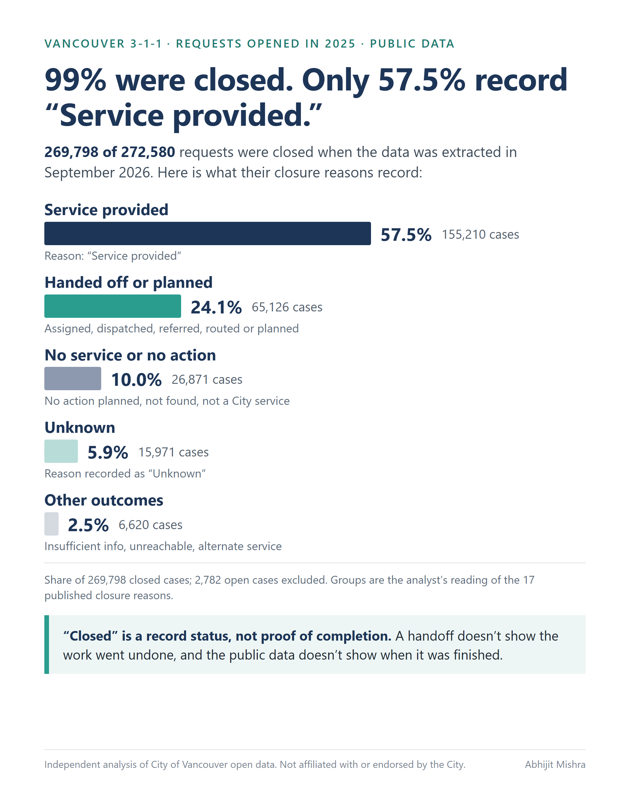
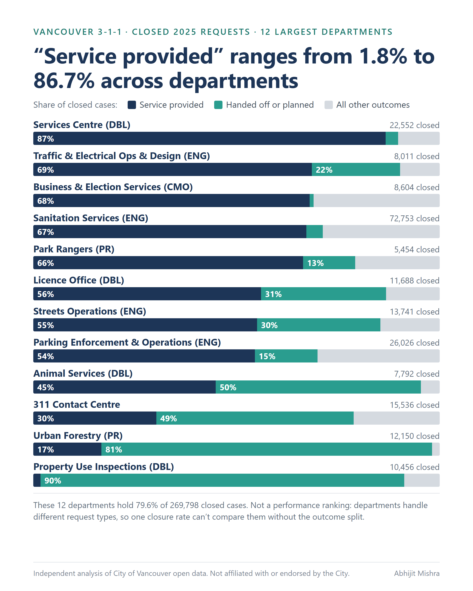
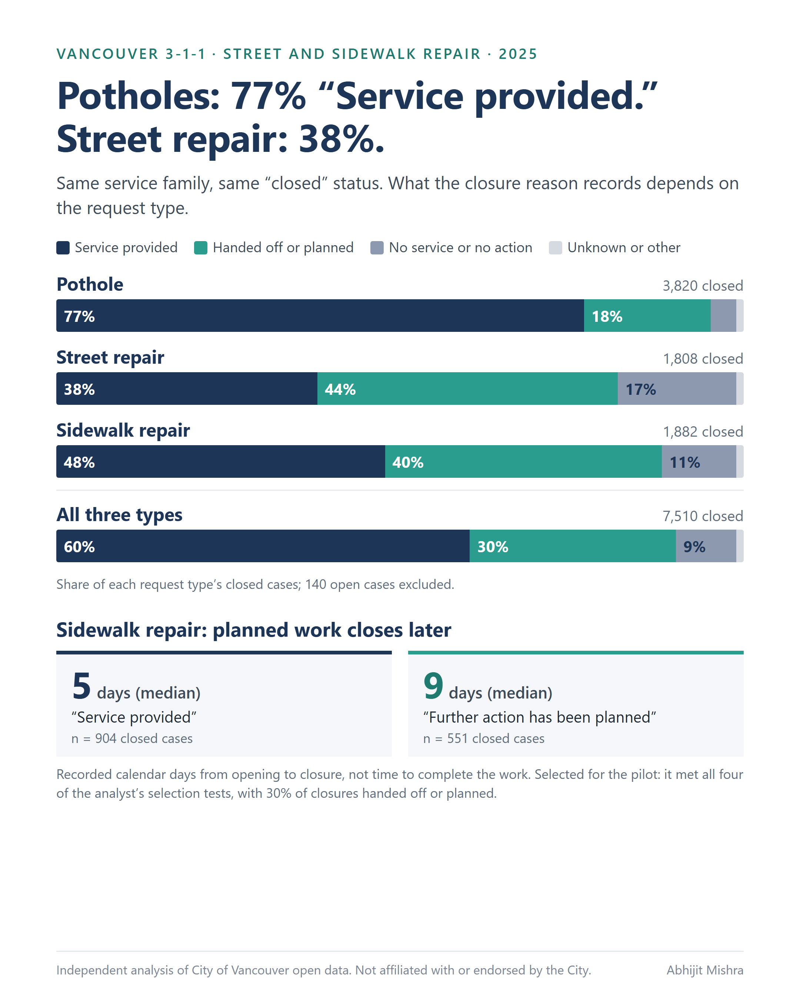
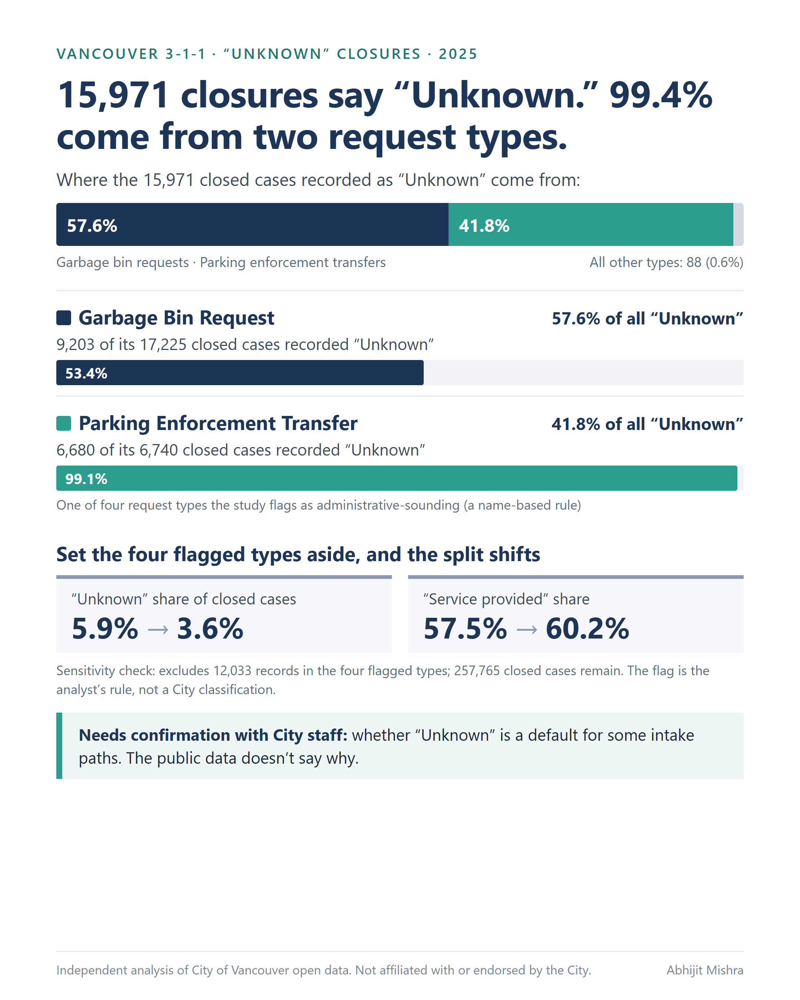
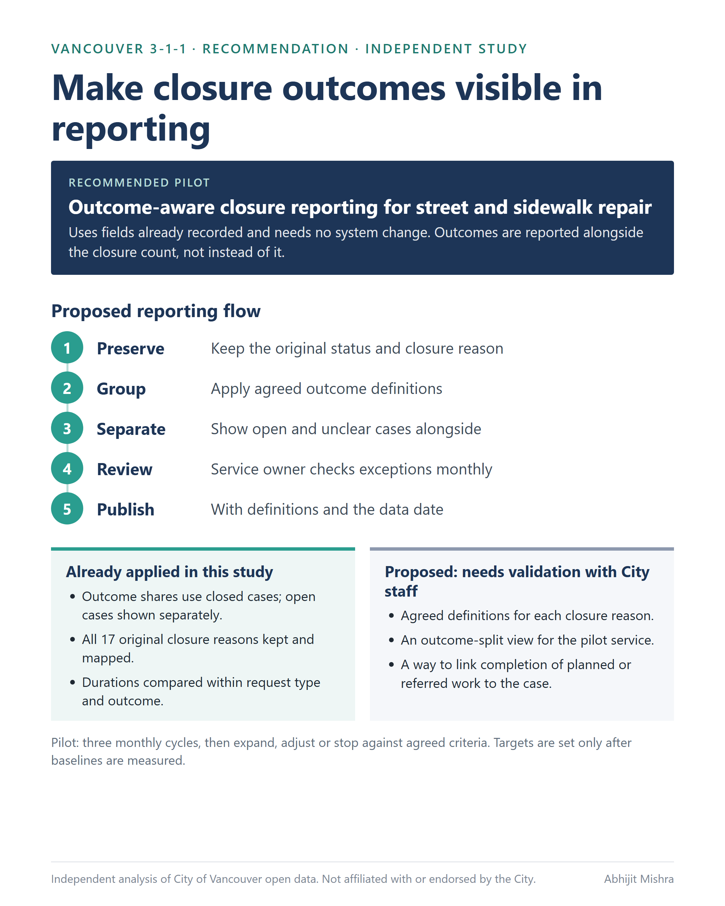

# What Does "Closed" Mean?

**Making Vancouver 3-1-1 performance reporting decision-ready**

An independent business analysis of the City of Vancouver's public 3-1-1 service-request data, covering the
272,580 requests opened in 2025.

> **Independent work on public data.** This study is not affiliated with, endorsed by, or informed by any internal
> knowledge of the City of Vancouver. The outcome groups used throughout are **my interpretation of published closure
> wording**, not City definitions. Nothing here shows that the City's internal reporting is wrong, or that any request
> was left unresolved. It shows what the public data can and cannot tell a reader.

---

## The question

A service report can say 99% of requests were **closed**. That reads like 99% were resolved.

But "closed" is a record status. The public data also publishes a **closure reason** for each case, and those reasons
describe very different situations: work that was done, work that was handed to someone else, decisions not to act, and
cases with no stated outcome.

So the question this study answers is:

> **Can a closed 3-1-1 case be read as a completed service?**

## What the data shows

Of the 272,580 requests opened in 2025, **269,798 (99.0%) were closed** when I extracted the data on 2026-09-11, and
2,782 (1.0%) were still open. Breaking those closures down by their published reason:

| Outcome group (analyst-defined) | Closed cases | Share of closed cases |
|---|---:|---:|
| Service provided | 155,210 | 57.5% |
| Work assigned, referred or continuing ("handed off or planned") | 65,126 | 24.1% |
| No service or no action recorded | 26,871 | 10.0% |
| Unknown or N/A | 15,971 | 5.9% |
| Insufficient information / could not proceed | 4,998 | 1.9% |
| Other – requires review | 1,622 | 0.6% |
| **Total closed** | **269,798** | **100%** |



**Three things follow from this.**

**1. "Closed" covers several different recorded outcomes.** Just over half of closures record that the service was
provided. About a quarter record a handoff or planned work, with reasons such as "Assigned to inspector", "Dispatched to
Crew" and "Further action has been planned". A handoff does **not** show the work was left undone — it shows that
whether it was finished is not published.

**2. One closure rate cannot compare departments.** Across the 12 largest departments by volume (79.6% of all closed
cases), the "Service provided" share runs from 1.8% to 86.7% *of each department's own closed cases*. Departments handle
different kinds of requests, so this is not a performance ranking — it is the reason a single closure rate is not
comparable across them.



**3. The same pattern appears inside one service family.** In street and sidewalk repair, "Service provided" accounts
for 77% of closed pothole cases but 38% of closed street-repair cases. Sidewalk closures recorded as "Further action has
been planned" took a median of 9 recorded calendar days to close, against 5 for "Service provided".



**One more pattern worth flagging:** 99.4% of the 15,971 closures recorded as "Unknown" come from just two request
types. Whether "Unknown" is a system default for certain intake paths is a question for City staff; the public data
doesn't say.



## Recommendation

Pilot **outcome-aware closure reporting** for street and sidewalk repair: agree what each closure reason means, then
report those outcomes **alongside** the closure count, not instead of it. It uses fields already published and needs no
system change.

The full report scores four options against seven criteria and sets out a five-step reporting flow, three
implementation steps with proposed roles and success measures, and the questions to settle with City staff first. Those
scores are my preliminary outside-in judgement, and I would re-score them with the people who own the process.



## What this analysis cannot show

- **Public data only.** No interviews, no internal documents, no access to City systems.
- **Closure reasons describe the record, not a verified outcome.** Even "Service provided" needs its operational meaning
  confirmed.
- **No case identifier is published,** so referrals, reopenings and follow-up work cannot be traced between cases.
- **Durations are recorded calendar days to closure** — close date minus local opening date — not resolution time or
  time spent working. The close field is a date, not a timestamp.
- **One year of data,** and the dataset can be updated after extraction.
- **No targets are proposed.** Setting service targets requires baselines and City input, so this study proposes none.

## What's in this repo

| Path | What it is |
|---|---|
| [`report/Vancouver311_What_Does_Closed_Mean.pdf`](report/Vancouver311_What_Does_Closed_Mean.pdf) | The case study: 4 main pages plus 2 appendix pages (method, full closure-reason mapping) |
| [`report/Vancouver311_Closure_Outcomes_Workbook.xlsx`](report/Vancouver311_Closure_Outcomes_Workbook.xlsx) | Power Query workbook: data dictionary, closure mapping, data-quality log, all calculations as formulas, dashboard |
| [`report/numbers_trace.csv`](report/numbers_trace.csv) | Every figure shown in the report mapped to the workbook cell it comes from |
| [`METHODOLOGY.md`](METHODOLOGY.md) | How the cohort, the outcome groups and the duration measure were built, and why |
| [`CALCULATIONS.md`](CALCULATIONS.md) | How each number was calculated and verified, including the denominator rules |
| [`DATA_QUALITY.md`](DATA_QUALITY.md) | The 19 data-quality checks, what each found, and how it changed the analysis |
| [`data/closure_outcome_mapping.csv`](data/closure_outcome_mapping.csv) | All 17 published closure reasons, their outcome group, the rationale and the validation question |
| [`data/duration_frequency_2025.csv`](data/duration_frequency_2025.csv) | Days-to-closure frequency table used for the percentile calculations |
| `scripts/` | Python and Power Query source that rebuilds every figure |
| [`requirements.txt`](requirements.txt) | Python dependencies for the scripts above |
| `assets/` | Summary graphics |

**The row-level data is not in this repo.** The cleaned 2025 cohort is a 57 MB CSV, too large to belong in version
control. `scripts/01_download.py` rebuilds it from the Open Data Portal API, and `scripts/03_analyze.py` recalculates
every figure from it.

## Reproducing this

```bash
pip install -r requirements.txt
```

On Windows, where the `py` launcher selects the interpreter:

```bash
py -3.13 scripts/01_download.py    # export the buffered window from the Open Data Portal API
py -3.13 scripts/02_profile.py     # profile fields, run the data-quality checks
py -3.13 scripts/03_analyze.py     # build the 2025 local-date cohort and every figure
```

On macOS or Linux, the same three steps with `python3` in place of `py -3.13`:

```bash
python3 scripts/01_download.py
python3 scripts/02_profile.py
python3 scripts/03_analyze.py
```

`scripts/06_workbook_com.ps1` is Windows-only: it drives Excel through COM to load the Power Query
queries and recalculate the workbook, so it needs PowerShell and a local Excel installation. The
rest of the pipeline is cross-platform.

The workbook reads the CSV files in `data/` through Power Query, so `Data > Refresh All` rebuilds the analysis
sheets from source. Every displayed figure is also saved in the file, so nothing needs refreshing to read it.

Note that the data is live: re-running the download now will return a slightly different dataset than the
2026-09-11 extraction, because open cases close and records are updated over time.

## Source and licence

City of Vancouver Open Data Portal, dataset
["3-1-1 service requests"](https://opendata.vancouver.ca/explore/dataset/3-1-1-service-requests/), extracted
2026-09-11. Contains information licensed under the
[Open Government Licence – Vancouver](https://opendata.vancouver.ca/pages/licence/).

Address, latitude, longitude and geometry fields were removed before any file in this package was created. No
individual address appears in the report, the workbook or the data files published here.
