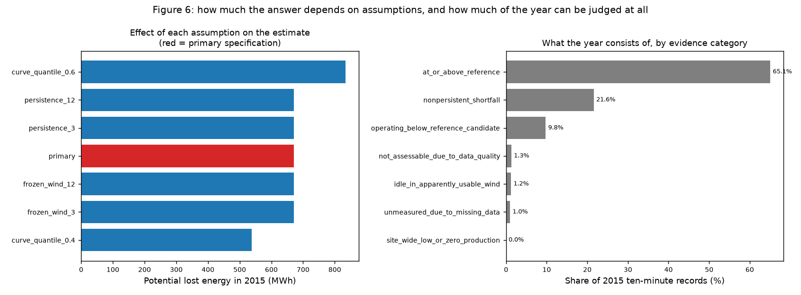
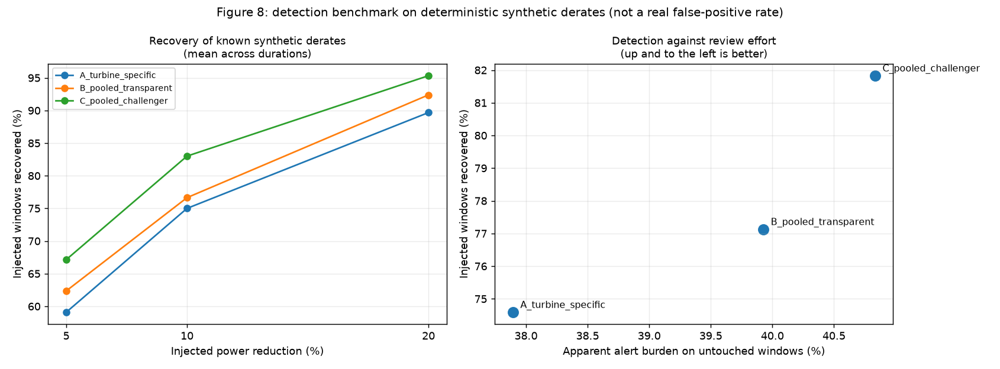

# Real Loss or Bad Data?

### Validating wind-turbine underperformance before modelling it

A four-turbine wind farm shows 672 MWh of apparent production shortfall in a
single year. This analysis establishes how much of that survives data validation,
which event warrants investigation first, and what cannot be concluded without
operational records the dataset does not contain.

**Independent project · Public data · [Interactive application](https://wind-underperformance-decision-support.streamlit.app/)**

### Start with the decision materials

| Deliverable | What it contains |
|---|---|
| **[Executive memo](deliverables/executive_memo.pdf)** | Three-page visual decision brief: recommendation, energy accounting, data trust, method comparison and evidence requests. |
| **[Case-study presentation](deliverables/La_Haute_Borne_performance_review.pptx)** | Eight-slide, evidence-led presentation with six editable charts, event prioritisation, method comparison and limitations. |
| **[Interactive decision tool](https://wind-underperformance-decision-support.streamlit.app/)** | Five-page Streamlit application with scenario controls, event timelines and grounded question answering. |

---

## At a glance

| | |
|---|---|
| **Business question** | Which issue should be investigated first, what is the exposure, how confident are we, and what evidence is needed before acting? |
| **Dataset** | ENGIE La Haute Borne, France · 4 × Senvion MM82 (2,050 kW) · 420,480 ten-minute records · 2014–2015 |
| **Reference year / assessment year** | 2014 (fit) → 2015 (assess), frozen between |
| **Methods compared** | 3 — turbine-specific curve, fleet-pooled curve, constrained gradient-boosted challenger |
| **Headline result** | 671.6 MWh gross shortfall, of which **380.8 MWh (57%)** sits in reviewable events |
| **Recommendation** | R80711, 26–28 Jul 2015 · 42.5 h · **36.8–37.6 MWh** · all 3 methods agree |
| **Validation** | **87 of 88 automated checks pass**; the one failure is a documented diagnostic finding |
| **Stack** | Python 3.11 · pandas · scikit-learn · Plotly · Streamlit |

---

## 1. Executive summary

1. **The analysis could not begin until three data defects were resolved.** The
   timestamps were an hour out for seven months of every year, the site meter was
   synthetic rather than measured, and missing records were clustered in runs of
   up to 132.8 hours. Each is quantified in §3.

2. **Gross shortfall for 2015 is 671.6 MWh, but only 380.8 MWh (57%) is
   reviewable.** The remainder is sub-threshold noise. Across reasonable
   specifications the total ranges 538–834 MWh (±22%), driven almost entirely by
   one unavoidable judgement — the reference quantile.

3. **Comparing each turbine against its own history produced the wrong priority.**
   Pooling the reference across the fleet reversed which turbine ranks worst,
   because R80711's own curve sits 11–19 kW below its neighbours'. Pooling, not
   machine learning, was the change that altered a decision.

4. **The machine-learning challenger passed its pre-registered benchmark but is
   not deployable.** Recovery improved 0.771 → 0.818, yet all three methods alert
   on 38–41% of untouched control windows. The acceptance rule I wrote constrained
   only relative burden, not absolute — an incomplete rule, documented rather than
   retrofitted.

5. **One event is recommended for investigation, and it is testable with a single
   record request.** 42.5 hours of near-zero output while three neighbours ran
   normally. Five operational explanations fit equally well; none can be
   distinguished from this data.

---

## 2. Business context and objective

Operational wind data is routinely used to estimate lost production and to
challenge availability figures. Those estimates are only as good as the data
beneath them, and the failure mode is quiet: a plausible-looking number built on
an undetected data defect is worse than no number, because it gets acted on.

**Objective.** Produce a defensible answer to four linked questions:

| # | Question | Section |
|---|---|---|
| 1 | Is the data fit to support a performance conclusion? | §3 |
| 2 | How much potential shortfall remains after validation? | §5 |
| 3 | Which single issue should be investigated first? | §7 |
| 4 | What evidence is required before anyone acts? | §7, §8 |

**Explicitly out of scope:** diagnosing causes, claiming recoverable energy, and
optimising model accuracy for its own sake.

---

## 3. Data quality assessment

**Source.** ENGIE La Haute Borne, Meuse, France. Four Senvion MM82 turbines,
2,050 kW each, 80 m hub height. 420,480 ten-minute records, 2014-01-01 to
2015-12-31 UTC. Etalab Open Licence 2.0, obtained via the
[OpenOA](https://github.com/NatLabRockies/OpenOA) repository.

**Schema constraint.** Seven measurement columns. **No status, event or alarm
codes exist**, so every turbine state must be inferred and every loss category is
an assumption rather than an observation. This constraint shapes the entire
analysis.

### 3.1 Findings

| # | Finding | Evidence | Consequence |
|---|---|---|---|
| 1 | **Summer timestamps one hour early** | Every local day held exactly 144 records, including both clock-change days, which a DST-aware logger cannot produce. Confirmed by sequence continuity and by ERA5 seasonal lag. | Affects ~7 months/year. Any join to another time series would be an hour out. |
| 2 | **Clock-change days corrupted** | 48 duplicate and 48 absent intervals, all on spring/autumn transition dates. | Symptom of finding 1; resolved by the same correction. |
| 3 | **Site meter is synthetic** | Ratio to turbine sum 0.980, σ 0.008, correlation 0.9997 — a fixed loss factor with noise. Confirmed in the OpenOA loader source. | **Removes the only external cross-check.** All validation is internal. |
| 4 | **Availability and curtailment fields are estimates** | Derived from SCADA by the publisher. | Cannot serve as ground truth or labels. |
| 5 | **Missing data clustered, not scattered** | 2,569 absent values in 65 runs; longest 132.8 h; 388 gaps site-wide. | Zero-filling would invent >5 days of false outage on one turbine. |
| 6 | **Zero-power in usable wind** | 3,824 records (0.91%). | The analytical target — and its cause is unknowable here. |

### 3.2 Timestamp correction — validation

| Check | Before | After |
|---|---|---|
| Duplicate intervals | 48 | **0** |
| Absent intervals | 48 | **0** |
| Seasonal lag vs ERA5 | −1 h | **0 h** |
| Energy conserved | — | Exact |

*All 9 correction checks passed.* Detail:
[data audit](docs/phase_1_findings.md) · [validation](docs/phase_2_findings.md)

### 3.3 Dataset after validation

| Stage | Records | Share |
|---|---|---|
| Raw | 420,480 | 100% |
| Reference-eligible | 336,928 | **80.13%** |
| Excluded from curve fitting | 83,552 | 19.87% |
| 2015 assessable | 207,790 | 98.83% of 2015 |
| Unmeasured or unassessable | 4,845 | 2.30% of 2015 |

"Reference-eligible" means the record passed data-quality rules. It does **not**
mean the turbine was operating correctly — without event logs that cannot be known.

---

## 4. Methodology

**Approach.** Fit an empirical reference power curve per turbine on 2014
reference-eligible records, freeze it, apply to 2015, and treat the shortfall
against it as *potential* lost energy.

| Parameter | Value | Rationale |
|---|---|---|
| Binning | 0.5 m/s, median power | Transparent, no distributional assumption |
| Wind speed | Density-corrected | IEC 61400-12-1 via OpenOA |
| Minimum bin support | 30 records | Sparse bins left empty, never interpolated |
| Below cut-in (4.5 m/s) | Expected = 0 by definition | Measured empirically, not assumed |
| Event persistence | 6 records (1 hour) | Suppresses turbulence noise |

**Loss formula**

```
potential_lost_energy_kwh = max(expected_kw − max(actual_kw, 0), 0) × (10/60)
```

Actual power is floored at zero so that auxiliary consumption by an idle turbine
is never counted as production loss.

**Evidence hierarchy** — applied to every statement in the project:

| Level | Test | Where this project lands |
|---|---|---|
| Observation | Reproducible from the data | Every energy figure |
| Hypothesis | A cause that predicts something checkable | Every operational explanation |
| Validated finding | Supported by independent evidence | **None** — no operational record exists |

---

## 5. Results — energy accounting

| Quantity | 2015 | Note |
|---|---|---|
| Gross positive residual shortfall | **671.6 MWh** | Against a statistical reference |
| Inside persistent reviewable events | **380.8 MWh** | 57% of gross |
| Non-persistent short dips | **290.8 MWh** | 43% — sub-threshold |
| Energy lost during missing data | **unknown** | Not zero |
| Records not assessable | 2,771 | No expected value computable |

> **Potential shortfall is not confirmed recoverable energy.** It is the gap
> between observed output and a reference built from the same machines' own past.

### 5.1 Sensitivity

| Specification | Total (MWh) | Δ vs primary |
|---|---|---|
| Reference quantile 0.40 | 538 | **−20%** |
| **Primary (median)** | **672** | — |
| Reference quantile 0.60 | 834 | **+24%** |
| Frozen-wind threshold 3 / 12 records | 672 | ±0.03 MWh |
| Persistence 3 / 12 records | 672 | 0 (changes attribution only) |

**Interpretation.** One assumption dominates — the reference quantile, at ±22%,
with no measurement available to settle it. The threshold flagged as a concern in
advance (frozen wind sensors) proved immaterial.



*The range is analytical uncertainty, not a revenue claim. Potential shortfall
is not confirmed recoverable energy.*

---

## 6. Method comparison — a pre-registered experiment

Three methods, all fitted on the same 2014 subset and frozen before 2015. Method
and acceptance rule were [committed before any model was trained](docs/phase_3_method.md).

| | Method | Purpose in the design |
|---|---|---|
| **A** | Turbine vs its own history | Incumbent baseline |
| **B** | Same method, pooled across the fleet | **Control** — isolates pooling from modelling |
| **C** | Constrained pooled gradient-boosted challenger | Isolates model flexibility |

### 6.1 Results

| Metric | A | B | C |
|---|---|---|---|
| Injected-event recovery | 0.746 | 0.771 | **0.818** |
| Apparent alert burden | 0.379 | 0.399 | 0.408 |
| Recovery − burden | 0.367 | 0.372 | **0.410** |
| Agreement with B | 71.8% | — | **44.7%** |

**Attribution of the gain:** pooling +2.5 points, model flexibility +4.7 points.
Without method B in the design, all 7.2 would have been credited to machine
learning.

### 6.2 The result that changed the conclusion

| Turbine | A (self-referenced) | B (fleet-pooled) | C |
|---|---|---|---|
| R80711 | 4.36% | **5.35%** | **4.72%** |
| R80721 | 4.22% | 4.49% | 3.56% |
| R80736 | 4.25% | 4.15% | 3.23% |
| R80790 | **6.15%** | 5.10% | 4.58% |

Method A names R80790 as worst. Pooled against the fleet, **R80711 is worst** —
because its own curve sits 11–19 kW below its neighbours', so self-reference
flatters it. An earlier version of this analysis named the wrong turbine, read off
a scatter plot rather than measured; the correction is recorded in the project
history rather than edited away.

**Qualification.** Removing the single July event drops R80711 from 5.35% to
4.46%, below R80790. Its fleet ranking is **event-driven, not a persistent
pattern** — which changes how the recommendation in §7 should be read.

### 6.3 Verdict on the challenger

**Passed the registered benchmark. Not deployable for automated alerting.**

All three methods alert on 38–41% of untouched control windows. The acceptance
rule constrained only the *relative* increase in burden against B, never the
absolute level — so a method could pass by being no worse than an alternative that
was itself unusable. That was an incomplete rule, recorded as a methodological
lesson rather than rewritten after the fact.

**Method B is the decision method.** C is a qualified second opinion.



*The challenger clears the pre-registered recovery test, but the absolute alert
burden remains too high for automated operational alerting.*

---

## 7. Recommendation

### Investigate: Turbine R80711 · 26–28 July 2015 · 42.5 hours

| | |
|---|---|
| **Potential shortfall** | 36.8–37.6 MWh |
| **Illustrative exposure** | €1,842–4,513 at €50–120/MWh *(not actual revenue)* |
| **Methods agreeing** | **A + B + C** |
| **Confidence** | Medium — the ceiling, as no operational record exists |
| **Data-quality qualifications** | None |

**Observed.** 97.6% of 255 consecutive records at or below zero against an
expected 901 kW, while all three neighbours produced continuously at 724–840 kW in
the same 5–12 m/s wind. The turbine tracked expectation closely in the preceding
48 hours.

**Hypotheses — all equally consistent with the evidence, none established:**
planned maintenance · unplanned fault stop · grid curtailment · controller lockout
· communications loss while producing.

**Next action.** Request event and alarm codes, work orders, curtailment
instructions and operator logs for the interval. Normally held by site operations,
with curtailment records from the commercial team.

| Outcome | Decision |
|---|---|
| **Escalate** | Codes show an unplanned fault with no work order, or no record of the outage at all |
| **Close** | Records show a planned service visit or documented grid instruction |

**Review point:** five business days after records are received.

---

## 8. Limitations

| Limitation | Impact |
|---|---|
| No event codes, work orders or curtailment records | Every operational explanation remains a hypothesis |
| Site meter is synthetic | No external validation; all checks internal |
| Four turbines only | Weak fleet reference; a site-wide problem stays invisible |
| 2014 vs 2015 resource differs by +13.3% mean cubed wind | Raw annual energy must never be compared between years |
| Synthetic detection benchmark | An upper bound on real-world detection |
| No labels in the real data | No precision or recall figure exists for any method |
| 2015 data | Describes nothing about the site today |

**No finding in this project reaches "validated finding" on its own evidence
hierarchy.**

---

## 9. Validation and reproducibility

**87 of 88 automated checks pass.** A script cannot report a check as passed
unless the check executed.

| Stage | Checks |
|---|---|
| Timestamp correction | 9 / 9 |
| Data preparation | 11 / 11 |
| Baseline model | 9 / 9 |
| Method comparison | 12 / 13 |
| Decision register | 7 / 7 |
| Deliverable rendering | 14 / 14 |
| Application | 25 / 25 |

The single failure is the wind-direction leakage check, which fired exactly as
designed; the diagnostic it triggered showed the conclusion holds without the
feature.

**Three corrections of mine are recorded in place rather than edited out:** the
wrong turbine named as having the shallower curve, an incomplete acceptance rule,
and a classification label that hid 290.8 MWh of real shortfall inside a category
saying nothing was wrong.

```bash
# From the project root. Windows paths shown; use .venv/bin/python elsewhere.
python -m venv .venv
.venv/Scripts/python.exe -m pip install -r requirements.txt
# Download the data first — see data/README.md

cd src
../.venv/Scripts/python.exe data_audit.py                  # audit, changes nothing
../.venv/Scripts/python.exe timestamp_correction.py        # test the timestamp hypothesis
../.venv/Scripts/python.exe prepare_data.py                # processed dataset, thresholds
../.venv/Scripts/python.exe baseline_model.py              # reference curves, sensitivity
../.venv/Scripts/python.exe ml_challenger.py               # pooled curve + challenger
../.venv/Scripts/python.exe decision_register.py           # decision register
../.venv/Scripts/python.exe build_deliverables.py          # verify deck and rebuild visual memo
../.venv/Scripts/python.exe export_presentation_tables.py  # chart tables
../.venv/Scripts/python.exe validate_app.py                # application validation
```

CPython 3.11.0, Windows. All versions pinned in `requirements.txt` including
transitive dependencies. Raw files are read and never modified.

---

## 10. Deliverables

**Interactive application** — a decision tool, not a report.

```bash
.venv/Scripts/python.exe -m streamlit run app/app.py
```

| Page | Answers |
|---|---|
| Executive cockpit | Which issue first, exposure, confidence, record needed |
| Investigation explorer | 25-event register, filterable, with timelines and escalation criteria |
| Method and scenario lab | Why A, B and C disagree, plus the synthetic benchmark |
| Data trust | Funnel, exclusions, completeness, timestamp test, gap chart |
| Ask the analysis | Grounded Q&A over the project's own documents and tables |

The application reads generated tables and **never trains a model at runtime**.
Setup and optional AI configuration: [`RUN_APP.md`](RUN_APP.md).

**Decision-ready files:**

- **[Executive memo](deliverables/executive_memo.pdf)** — a three-page visual
  brief separating measured evidence, interpretation and the records still
  required before action.
- **[Case-study presentation](deliverables/La_Haute_Borne_performance_review.pptx)**
  — eight slides with six editable charts covering the investigation queue,
  timestamp validation, energy accounting, event behaviour, ranking reversal
  and the recovery-versus-alert-burden trade-off.
- Both files retain the central caveats, carry source attribution and project
  links, and pass all **14 deliverable render checks** recorded in
  [`outputs/tables/phase4_render_checks.csv`](outputs/tables/phase4_render_checks.csv).

**Full write-ups:** [data audit](docs/phase_1_findings.md) ·
[baseline and validation](docs/phase_2_findings.md) ·
[pre-registered method](docs/phase_3_method.md) ·
[method comparison](docs/phase_3_findings.md) ·
[decision logic](docs/phase_4_findings.md) ·
[every analytical decision](docs/methodology_decisions.md)

```
wind-underperformance-decision-support/
├── data/raw/           # Downloaded data, never edited, not in git
│   └── processed/      # Flagged dataset, every raw row preserved
├── src/                # Analysis and reproducible deliverable builders
├── app/                # Decision tool: app, charts, data, assistant, content
├── outputs/tables/     # Every result, including every validation check
│   └── figures/        # Eight figures
├── docs/               # Findings, pre-registered method, decision log
└── deliverables/       # Memo PDF and slide deck
```

---

## 11. Data licence and independence

ENGIE **La Haute Borne** wind farm data is published under the **Etalab Open
Licence 2.0** and obtained via the OpenOA repository. Air-density correction
follows IEC 61400-12-1 as implemented in OpenOA. **The raw data is not committed** —
see [`data/README.md`](data/README.md) for the download command, licence and
checksum.

This is an independent personal project using public data. **No Clir Renewables
data, software or methodology was used, and nothing here describes Clir, its
platform, its methods or its customers.** The site owner and turbine manufacturer
are named only because the public dataset names them; no conclusion is drawn about
either. All prices are illustrative — no tariff, PPA or market price is known for
this site.

---

**[Abhijit Mishra](https://github.com/Abhijit2409)** ·
[Portfolio](https://abhijitmishraportfolio.netlify.app/) ·
[LinkedIn](https://www.linkedin.com/in/mishraabhijit)
